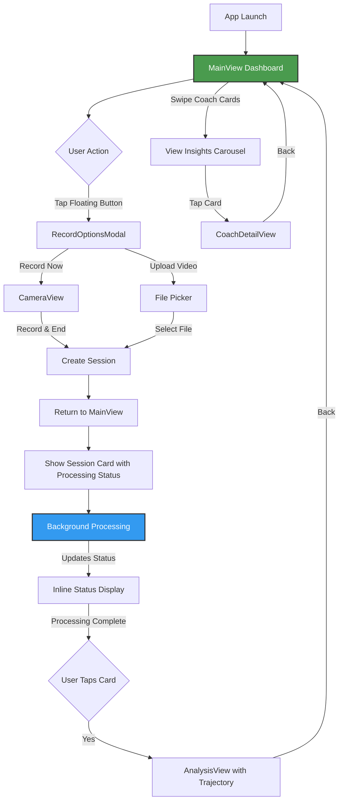
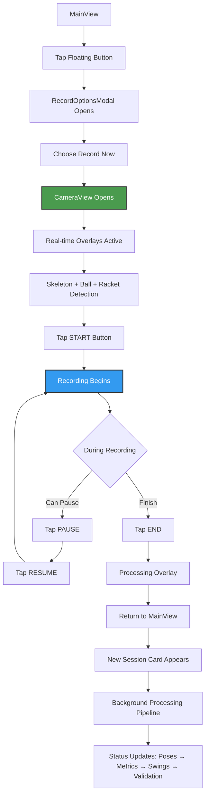
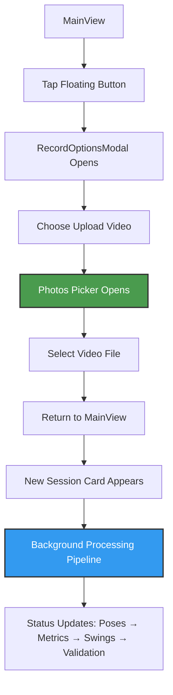
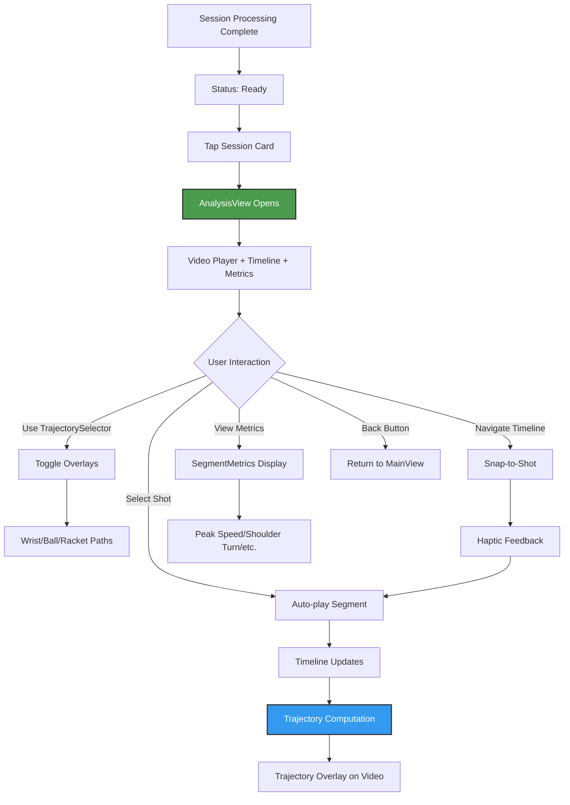
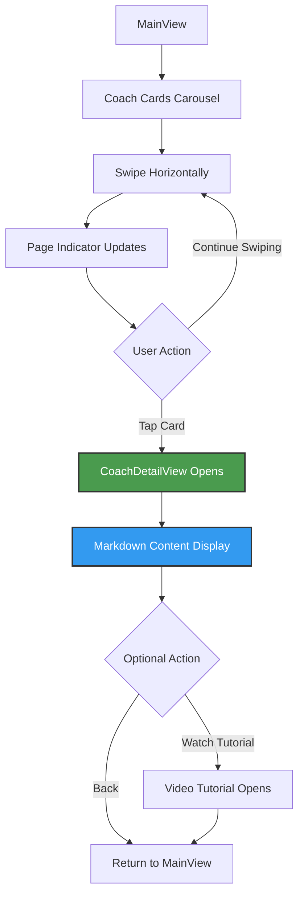

# Tennis App - User Flow & UI Screens (v2.0)

## Current Implementation Flow



---

## Screen Designs

### 1. MAINVIEW - Single Dashboard (Root View)

```
┌──────────────────────────────────────────┐
│                                          │
│  Victor • USTR 3.5 → 4.0                │
│  ▣                                       │
│                                          │
│  ╔══════════════════════════════════╗    │
│  ║ ✨ AI Coach Insight   [Forehand] ║    │
│  ║                                  ║    │
│  ║ Your contact point is moving    ║    │
│  ║ forward nicely. Keep working →  ║    │
│  ╚══════════════════════════════════╝    │
│       ━━━━━━━━━━━━━━━━━━━━━          │
│            ████░░░░░░                    │
│         (Page 1 of 3)                    │
│                                          │
│  Recent Sessions                         │
│  ┌────────────────────────────────────┐  │
│  │  [Video Thumbnail 200pt]           │  │
│  │  ⟳ Detecting swings...             │  │ ← Processing overlay
│  │  Today 2:30 PM                     │  │
│  └────────────────────────────────────┘  │
│                                          │
│  ┌────────────────────────────────────┐  │
│  │  [Video Thumbnail 200pt]           │  │
│  │  ✓ Ready • 7.2 avg • 5 shots      │  │ ← Complete session
│  │  Yesterday 4:15 PM                 │  │
│  └────────────────────────────────────┘  │
│                                          │
│                    [ ⊕ ]                 │ ← Floating button (64pt)
└──────────────────────────────────────────┘

Components:
- Profile header with avatar
- Coach insights carousel (horizontal swipe)
- Video session cards with inline status
- Floating action button (bottom-right)
```

**Key Features:**
- Single scrollable view
- Non-blocking processing status
- Video thumbnails update based on selected shot
- Glass morphism effects on cards

---

### 2. CAMERA VIEW

```
┌──────────────────────────────────────────┐
│  [🚶] [🎾]                              │ ← Toggle overlays
│         [Live Camera Feed]               │
│                                          │
│      [Skeleton Overlay Active]           │
│      [Green/Yellow/Red joints]           │
│                                          │
│      [Ball Detection Boxes] 🟡           │
│      [Racket Detection Boxes] 🎾         │
│                                          │
│  ● 1:23  •  8.2 fps                     │ ← Recording indicator
│                                          │
├──────────────────────────────────────────┤
│                                          │
│           ╔══════════╗     ╔═══════╗     │
│           ║  START   ║     ║  END  ║     │
│           ╚══════════╝     ╚═══════╝     │
│                                          │
│         (START/PAUSE/RESUME + END)       │
│                                          │
└──────────────────────────────────────────┘

States:
- START → Records (green), shows PAUSE + END
- PAUSE → Shows RESUME + END  
- RESUME → Back to recording
- END → Stops and processes
- Real-time overlays: Skeleton + Ball + Racket detection
- YOLO11-based object detection with confidence indicators
- Toggle buttons for skeleton and object overlays
- Returns to MainView immediately after END
```

---

### 3. ANALYSIS VIEW (Post-Processing Only)

```
┌──────────────────────────────────────────┐
│ ←                                        │
├──────────────────────────────────────────┤
│                                          │
│         [Video Player - 320pt height]    │
│              ▶ 0:23 / 1:45              │
│                                          │
│      [Trajectory Overlay on video]       │
│      [Ball/Racket/Wrist paths] 🟡───🟡   │
│      [Auto-computed on shot selection]   │
│                          [TrajectorySelector] │
│                           🎚️ Controls    │
│      [Playing: Forehand] (when segment   │
│       active)                            │
├──────────────────────────────────────────┤
│                                          │
│  TimelineStripEnhanced (with padding)    │
│  ◀ ──●────◇──●──◎──●────◇────●──── ▶    │
│     FH    BH  FH  FH   BH    FH         │
│  • Snap-to-shot selection                │
│  • Auto-play segments on selection       │
│  • Haptic feedback on navigation         │
├──────────────────────────────────────────┤
│                                          │
│  ╔════════════════════════════════════╗  │
│  ║ [Shot Type] (Forehand/Backhand)    ║  │
│  ║                                    ║  │
│  ║ ⚡ Peak Speed: 15 rad/s            ║  │
│  ║ 🔄 Shoulder Turn: 120°             ║  │
│  ║ 🎯 Contact Height: 85%             ║  │
│  ║ ↗️ Follow Through: 78%             ║  │
│  ║ ✅ Tracking Quality: 94%           ║  │
│  ║ (All from SegmentMetrics)          ║  │
│  ╚════════════════════════════════════╝  │
│                                          │
└──────────────────────────────────────────┘

Features:
- ScrollView with VStack layout
- Video player with glass morphism styling
- Trajectory overlay directly on video player
- TrajectorySelector in top-trailing corner
- On-demand trajectory computation per shot
- Auto-play segments when shots are selected
- TimelineStripEnhanced with prev/next navigation
- Simple metrics from SegmentMetrics (no AI insights)
- Glass container styling for metrics card
- Haptic feedback on shot navigation
```

---

### 4. RECORD OPTIONS MODAL

```
┌──────────────────────────────────────────┐
│                                          │
│     ╔════════════════════════════╗       │
│     ║                            ║       │
│     ║   How do you want to      ║       │
│     ║   add a swing?             ║       │
│     ║                            ║       │
│     ║  ┌──────────────────────┐ ║       │
│     ║  │   📹 Record Now      │ ║       │
│     ║  └──────────────────────┘ ║       │
│     ║                            ║       │
│     ║  ┌──────────────────────┐ ║       │
│     ║  │   📁 Upload Video    │ ║       │
│     ║  └──────────────────────┘ ║       │
│     ║                            ║       │
│     ╚════════════════════════════╝       │
│                                          │
│            [Tap to dismiss]              │
└──────────────────────────────────────────┘

Glass modal with two options only
```

---

### 5. COACH DETAIL VIEW

```
┌──────────────────────────────────────────┐
│ ←                                        │
├──────────────────────────────────────────┤
│                                          │
│  ╔════════════════════════════════════╗  │
│  ║ [Forehand]                         ║  │
│  ║                                    ║  │
│  ║ Late Contact Point                 ║  │
│  ║ ─────────────────────────────────  ║  │
│  ║                                    ║  │
│  ║ ## 👋 Hey Victor!                  ║  │
│  ║                                    ║  │
│  ║ I watched your last 5 sessions -   ║  │
│  ║ your grip and stance? *Chef's      ║  │
│  ║ kiss* 👨‍🍳                          ║  │
│  ║                                    ║  │
│  ║ ## 🎯 The Real Issue               ║  │
│  ║                                    ║  │
│  ║ You're making contact **0.3        ║  │
│  ║ seconds late**. That's the         ║  │
│  ║ difference between a rocket        ║  │
│  ║ and a push...                      ║  │
│  ║                                    ║  │
│  ║ [Scrollable markdown content]      ║  │
│  ╚════════════════════════════════════╝  │
│                                          │
│  ┌────────────────────────────────────┐  │
│  │ ▶ Watch Video Tutorial             │  │
│  └────────────────────────────────────┘  │
│                                          │
└──────────────────────────────────────────┘

Single glass card with unified content
Optional video link at bottom
```

---

## Processing Status States

### VideoSessionCard Status Overlays

```
PENDING
┌────────────────────────┐
│ [Blurred Thumbnail]    │
│ ⟳ Preparing...         │
└────────────────────────┘

EXTRACTING POSES
┌────────────────────────┐
│ [Blurred Thumbnail]    │
│ ⟳ Detecting motion     │
│ ▓▓▓▓░░░░░░ 40%        │
└────────────────────────┘

CALCULATING METRICS
┌────────────────────────┐
│ [Blurred Thumbnail]    │
│ ⟳ Computing metrics    │
└────────────────────────┘

DETECTING SWINGS
┌────────────────────────┐
│ [Blurred Thumbnail]    │
│ ⟳ Finding swings       │
└────────────────────────┘

VALIDATING SWINGS
┌────────────────────────┐
│ [Blurred Thumbnail]    │
│ ⟳ Validating 2/5       │
└────────────────────────┘

COMPLETE
┌────────────────────────┐
│ [Clear Thumbnail]      │
│ ✓ Ready • 7.2 • 5 shots│
└────────────────────────┘

FAILED
┌────────────────────────┐
│ [Blurred Thumbnail]    │
│ ⚠️ Failed • [Retry]     │
└────────────────────────┘
```

---

## Interaction Patterns

### Recording Flow



### Upload Flow



### Analysis Navigation



### Coach Insights Flow



---

## Key Design Decisions

### Why MainView First?
- Shows progress and history immediately
- Reduces anxiety about losing recordings
- Provides context through coach insights

### Why Floating Action Button?
- Always accessible
- Doesn't clutter main content
- Familiar mobile pattern

### Why Inline Processing?
- Non-blocking user experience
- Can record multiple videos
- Shows clear progress

### Why Timeline Navigation?
- Visual shot distribution
- Direct access to any moment
- Prev/next for sequential review

---