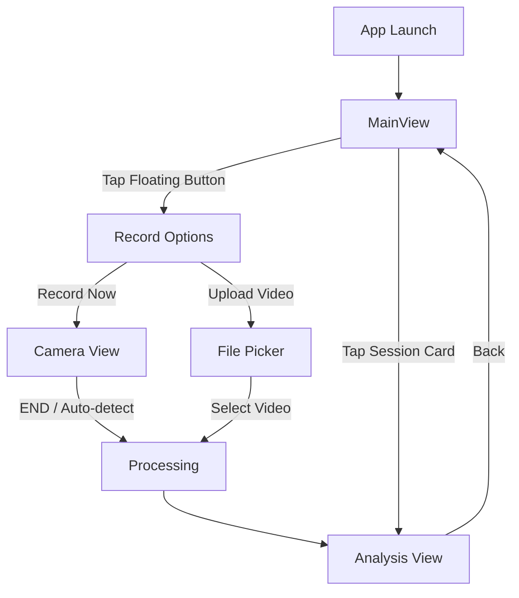
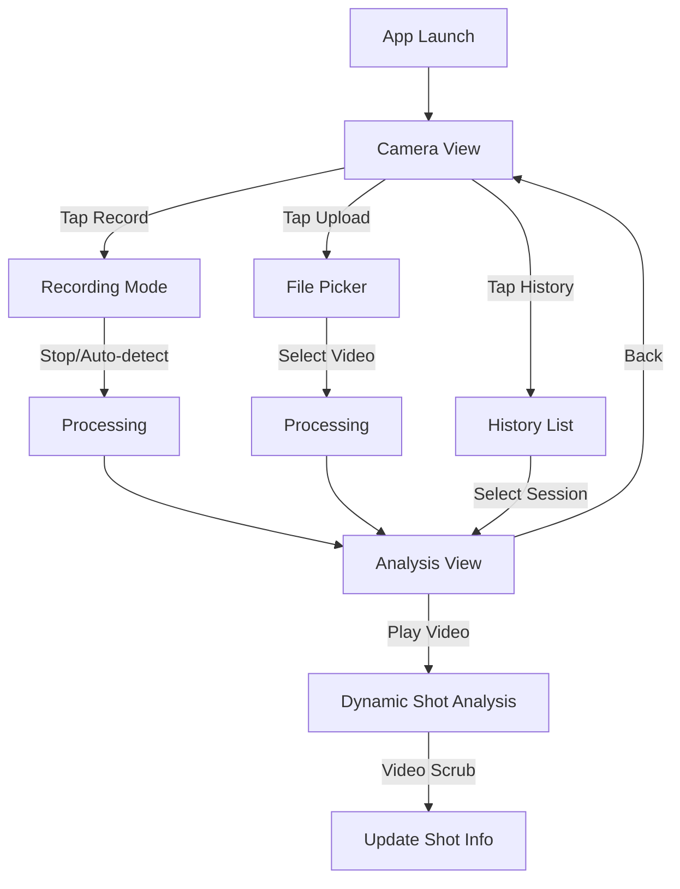

# Tennis App MVP - User Flow & UI Screens

## User Flow Diagram (Updated)



## Screen Designs

### 1. MAIN VIEW - Single Scrollable Dashboard

```
┌──────────────────────────────────────────────┐
│  Victor • USTR 3.5 → 4.0                    │
│  ┌────────────────────────────────────────┐  │
│  │  AI Coach Insight                     │  │
│  └────────────────────────────────────────┘  │
│                                              │
│  Recent Sessions                             │
│  ┌────────────────────────────────────────┐  │
│  │  [Video Thumbnail 200pt]               │  │
│  │  [Date]          [★ Avg] [N shots]     │  │
│  └────────────────────────────────────────┘  │
│   …                                          │
│                                              │
│                          ⊕                   │
└──────────────────────────────────────────────┘

Notes:
- Session card shows large video thumbnail, minimal info bar
- Play icon is subtle, non-dominant overlay
```

### 2. CAMERA VIEW (Full Screen)

```
┌─────────────────────────────┐
│ [Live Camera Feed]          │
│ [Skeleton Overlay Toggle]   │
├─────────────────────────────┤
│             ╔════════╗      │
│             ║ START  ║      │
│             ╚════════╝      │
│              [ END ]        │
└─────────────────────────────┘

States:
- Start/Pause/Resume center button
- End button appears during recording/paused
```

### 3. ANALYSIS VIEW

```
┌──────────────────────────────────────────────────────────┐
│ ←                                                        │
├──────────────────────────────────────────────────────────┤
│                                                          │
│                   [ Video Player ]                       │
│                      ▶ 0:23 / 1:45                       │
│                                                          │
├──────────────────────────────────────────────────────────┤
│  Glass Timeline Strip (56pt, adjustable, VO-ready)       │
│  ──────●────◇──●──◎──●────◇────●──────◇────●─────        │
│  Legend: ● Forehand  ◇ Backhand  ◎ Selected              │
├──────────────────────────────────────────────────────────┤
│ ⟨ Prev ⟩  [ FH 6.2 ] [ BH 7.1 ] [ FH 6.9 ] [ BH 7.9 ]  ▶ │
│      (44pt-high scrollable chips: primary tap targets)   │
├──────────────────────────────────────────────────────────┤
│ Insight Card                                             │
│  💡 Late contact. Hit 8" earlier.                        │
│  [Visual overlay on video at selected shot]              │
└──────────────────────────────────────────────────────────┘

Updates dynamically as video plays
```

#### Accessibility Enhancements (Analysis)
- 44pt-high chips as primary tap targets with labels (FH/BH + score)
- 56pt glass timeline strip with snap-to-nearest markers (≥32pt hit area)
- VoiceOver: timeline is Adjustable (Previous/Next), chips are Buttons
- Redundant coding: shape + label; color is not the only cue

## Interaction Details

### Recording Flow
```
● button → Recording (red)
    ↓
Auto-stop on shot detection
OR manual stop (tap again)
    ↓
Processing animation
    ↓
Analysis View
```

### Upload Flow
```
📁 icon → Native file picker
    ↓
Select video
    ↓
Processing animation
    ↓
Analysis View
```
# Tennis App MVP - User Flow & UI Screens

## User Flow Diagram



## Screen Designs

### 1. HOME SCREEN - Camera View (Full Screen)

```
┌─────────────────────────────┐
│                             │
│                             │
│                             │
│      [Live Camera Feed]     │
│                             │
│    [Skeleton Overlay On]    │
│                             │
│                             │
│                             │
│                             │
│                             │
│                             │
│                             │
│                             │
│                             │
├─────────────────────────────┤
│                             │
│  📁      ╔═══════╗      📊  │
│          ║   ●   ║          │
│          ╚═══════╝          │
│                             │
└─────────────────────────────┘

States:
- Default: Shows skeleton overlay
- Recording: Red dot, timer "0:23"
```

### 2. HISTORY VIEW

```
┌─────────────────────────────┐
│ ←                           │
├─────────────────────────────┤
│                             │
│ ┌─────────────────────────┐ │
│ │ ▶ [Video Thumbnail]     │ │
│ │   2:30 PM • 5 shots     │ │
│ └─────────────────────────┘ │
│                             │
│ ┌─────────────────────────┐ │
│ │ ▶ [Video Thumbnail]     │ │
│ │   Yesterday • 3 shots   │ │
│ └─────────────────────────┘ │
│                             │
│ ┌─────────────────────────┐ │
│ │ ▶ [Video Thumbnail]     │ │
│ │   Jan 21 • 8 shots      │ │
│ └─────────────────────────┘ │
│                             │
│ ┌─────────────────────────┐ │
│ │ ▶ [Video Thumbnail]     │ │
│ │   Jan 20 • 12 shots     │ │
│ └─────────────────────────┘ │
│                             │
└─────────────────────────────┘

Each row is tappable → Analysis
```

### 3. ANALYSIS VIEW

```
┌─────────────────────────────┐
│ ←                           │
├─────────────────────────────┤
│                             │
│      [Video Player]         │
│         ▶ 0:23/1:45         │
│                             │
│  Glass Timeline Strip        │
│  ──────●────◇──●──◎──●───   │
│  Legend: ● Forehand  ◇ Backhand  ◎ Selected│
│                             │
├─────────────────────────────┤
│                             │
│ Shot 2 - Forehand           │
│                             │
│ 💡 Late contact point       │
│                             │
│ Hit 8" earlier → HERE       │
│ [Visual overlay on video]   │
│                             │
│ ✓ Good shoulder rotation    │
│                             │
└─────────────────────────────┘

Updates dynamically as video plays (timeline and chips are primary navigation)
```

## Interaction Details

### Recording Flow
```
● button → Recording (red)
    ↓
Auto-stop on shot detection
OR manual stop (tap again)
    ↓
Processing animation
    ↓
Analysis View
```

### Upload Flow
```
📁 icon → Native file picker
    ↓
Select video
    ↓
Processing animation
    ↓
Analysis View
```

### History Flow
```
📊 icon → Video list
    ↓
Tap any video thumbnail
    ↓
Analysis View
```

## Key Design Principles

1. **Full screen camera** - No wasted space
2. **Icons only** - No text labels needed
3. **Video thumbnails** - Visual recognition in history
4. **Minimal metrics** - Time & shot count only
5. **No headers** - Back arrow is enough
6. **Dynamic content** - Analysis updates with playback

## Technical Implementation Order

1. Camera view with Vision skeleton
2. Recording with shot detection
3. Analysis view with video player
4. History with video thumbnails
5. Upload capability

## Success Metrics

- Time to record: 1 tap
- Time to insight: < 30 seconds
- UI elements on screen: < 5 per view
### History Flow
```
📊 icon → Video list
    ↓
Tap any video thumbnail
    ↓
Analysis View
```

## Key Design Principles

1. **Full screen camera** - No wasted space
2. **Icons only** - No text labels needed
3. **Video thumbnails** - Visual recognition in history
4. **Minimal metrics** - Time & shot count only
5. **No headers** - Back arrow is enough
6. **Dynamic content** - Analysis updates with playback

## Technical Implementation Order

1. Camera view with Vision skeleton
2. Recording with shot detection
3. Analysis view with video player
4. History with video thumbnails
5. Upload capability

## Success Metrics

- Time to record: 1 tap
- Time to insight: < 30 seconds
- UI elements on screen: < 5 per view