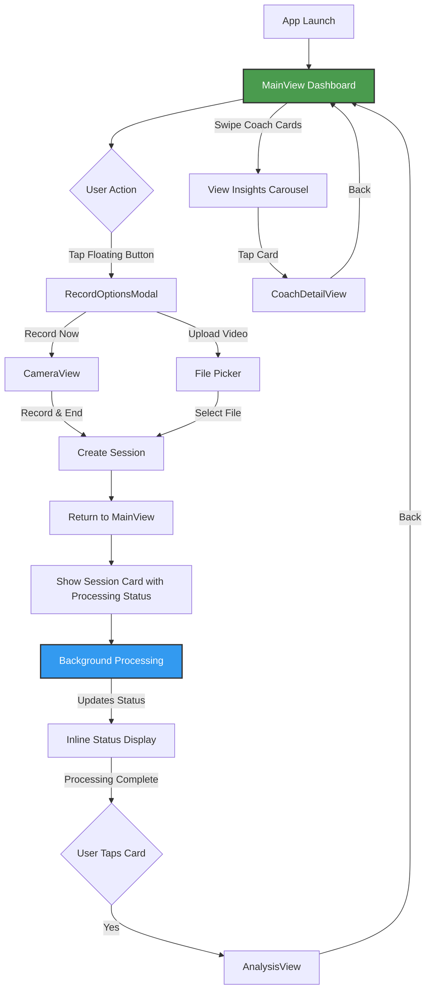

# Tennis App - User Flow & UI Screens (v2.0)

## Current Implementation Flow



---

## Screen Designs

### 1. MAINVIEW - Single Dashboard (Root View)

```
┌──────────────────────────────────────────┐
│                                          │
│  Victor • USTR 3.5 → 4.0                │
│  ▣                                       │
│                                          │
│  ╔══════════════════════════════════╗    │
│  ║ ✨ AI Coach Insight   [Forehand] ║    │
│  ║                                  ║    │
│  ║ Your contact point is moving    ║    │
│  ║ forward nicely. Keep working →  ║    │
│  ╚══════════════════════════════════╝    │
│       ━━━━━━━━━━━━━━━━━━━━━          │
│            ████░░░░░░                    │
│         (Page 1 of 3)                    │
│                                          │
│  Recent Sessions                         │
│  ┌────────────────────────────────────┐  │
│  │  [Video Thumbnail 200pt]           │  │
│  │  ⟳ Detecting swings...             │  │ ← Processing overlay
│  │  Today 2:30 PM                     │  │
│  └────────────────────────────────────┘  │
│                                          │
│  ┌────────────────────────────────────┐  │
│  │  [Video Thumbnail 200pt]           │  │
│  │  ✓ Ready • 7.2 avg • 5 shots      │  │ ← Complete session
│  │  Yesterday 4:15 PM                 │  │
│  └────────────────────────────────────┘  │
│                                          │
│                    [ ⊕ ]                 │ ← Floating button (64pt)
└──────────────────────────────────────────┘

Components:
- Profile header with avatar
- Coach insights carousel (horizontal swipe)
- Video session cards with inline status
- Floating action button (bottom-right)
```

**Key Features:**
- Single scrollable view
- Non-blocking processing status
- Video thumbnails update based on selected shot
- Glass morphism effects on cards

---

### 2. CAMERA VIEW

```
┌──────────────────────────────────────────┐
│                                          │
│         [Live Camera Feed]               │
│                                          │
│      [Skeleton Overlay Active]           │
│      [Green/Yellow/Red joints]           │
│                                          │
│                                          │
│                                          │
│                                          │
│                                          │
│                                          │
├──────────────────────────────────────────┤
│                                          │
│           ╔══════════╗                   │
│           ║  START   ║                   │
│           ╚══════════╝                   │
│                                          │
│         (Changes to END when recording)  │
│                                          │
└──────────────────────────────────────────┘

States:
- START → Records (red dot + timer)
- END → Stops and processes
- Skeleton overlay toggleable
- Returns to MainView immediately after END
```

---

### 3. ANALYSIS VIEW (Post-Processing Only)

```
┌──────────────────────────────────────────┐
│ ←                                        │
├──────────────────────────────────────────┤
│                                          │
│         [Video Player - Native Controls] │
│              ▶ 0:23 / 1:45              │
│                                          │
├──────────────────────────────────────────┤
│  Glass Timeline Strip (56pt)             │
│  ◀ ──●────◇──●──◎──●────◇────●──── ▶    │
│     FH    BH  FH  FH   BH    FH         │
│  Legend: ● Forehand  ◇ Backhand  ◎ Selected │
├──────────────────────────────────────────┤
│                                          │
│  ╔════════════════════════════════════╗  │
│  ║ Forehand                      7.2  ║  │
│  ║                                    ║  │
│  ║ ✅ What you did well               ║  │
│  ║ • Good shoulder rotation           ║  │
│  ║ • Maintained balance               ║  │
│  ║                                    ║  │
│  ║ ⚠️ Focus on improving              ║  │
│  ║ • Hit 6 inches earlier             ║  │
│  ║ • Transfer weight forward          ║  │
│  ╚════════════════════════════════════╝  │
│                                          │
└──────────────────────────────────────────┘

Features:
- Timeline with prev/next navigation
- Color-coded shot markers
- Balanced coaching feedback
- No shot chips (removed for simplicity)
```

---

### 4. RECORD OPTIONS MODAL

```
┌──────────────────────────────────────────┐
│                                          │
│     ╔════════════════════════════╗       │
│     ║                            ║       │
│     ║   How do you want to      ║       │
│     ║   add a swing?             ║       │
│     ║                            ║       │
│     ║  ┌──────────────────────┐ ║       │
│     ║  │   📹 Record Now      │ ║       │
│     ║  └──────────────────────┘ ║       │
│     ║                            ║       │
│     ║  ┌──────────────────────┐ ║       │
│     ║  │   📁 Upload Video    │ ║       │
│     ║  └──────────────────────┘ ║       │
│     ║                            ║       │
│     ╚════════════════════════════╝       │
│                                          │
│            [Tap to dismiss]              │
└──────────────────────────────────────────┘

Glass modal with two options only
```

---

### 5. COACH DETAIL VIEW

```
┌──────────────────────────────────────────┐
│ ←                                        │
├──────────────────────────────────────────┤
│                                          │
│  ╔════════════════════════════════════╗  │
│  ║ [Forehand]                         ║  │
│  ║                                    ║  │
│  ║ Late Contact Point                 ║  │
│  ║ ─────────────────────────────────  ║  │
│  ║                                    ║  │
│  ║ ## 👋 Hey Victor!                  ║  │
│  ║                                    ║  │
│  ║ I watched your last 5 sessions -   ║  │
│  ║ your grip and stance? *Chef's      ║  │
│  ║ kiss* 👨‍🍳                          ║  │
│  ║                                    ║  │
│  ║ ## 🎯 The Real Issue               ║  │
│  ║                                    ║  │
│  ║ You're making contact **0.3        ║  │
│  ║ seconds late**. That's the         ║  │
│  ║ difference between a rocket        ║  │
│  ║ and a push...                      ║  │
│  ║                                    ║  │
│  ║ [Scrollable markdown content]      ║  │
│  ╚════════════════════════════════════╝  │
│                                          │
│  ┌────────────────────────────────────┐  │
│  │ ▶ Watch Video Tutorial             │  │
│  └────────────────────────────────────┘  │
│                                          │
└──────────────────────────────────────────┘

Single glass card with unified content
Optional video link at bottom
```

---

## Processing Status States

### VideoSessionCard Status Overlays

```
PENDING
┌────────────────────────┐
│ [Blurred Thumbnail]    │
│ ⟳ Preparing...         │
└────────────────────────┘

EXTRACTING POSES
┌────────────────────────┐
│ [Blurred Thumbnail]    │
│ ⟳ Detecting motion     │
│ ▓▓▓▓░░░░░░ 40%        │
└────────────────────────┘

VALIDATING SWINGS
┌────────────────────────┐
│ [Blurred Thumbnail]    │
│ ⟳ Validating 2/5       │
└────────────────────────┘

AI ANALYSIS
┌────────────────────────┐
│ [Blurred Thumbnail]    │
│ ⟳ AI Analysis 3/5      │
└────────────────────────┘

COMPLETE
┌────────────────────────┐
│ [Clear Thumbnail]      │
│ ✓ Ready • 7.2 • 5 shots│
└────────────────────────┘

FAILED
┌────────────────────────┐
│ [Blurred Thumbnail]    │
│ ⚠️ Failed • [Retry]     │
└────────────────────────┘
```

---

## Interaction Patterns

### Recording Flow
1. Tap floating button (64pt target)
2. Choose "Record Now" from modal
3. Camera opens with skeleton
4. Tap START (becomes END)
5. Tap END or auto-stop
6. Returns to MainView
7. New session appears with processing status
8. Background processing continues

### Upload Flow
1. Tap floating button
2. Choose "Upload Video"
3. Select from Photos
4. Returns to MainView
5. Session processes in background

### Analysis Navigation
1. Processing completes (status: Ready)
2. Tap session card
3. View full analysis
4. Navigate shots via timeline
5. See coaching feedback
6. Back returns to MainView

### Coach Insights Flow
1. Swipe horizontally through carousel
2. See page indicator position
3. Tap any card for full detail
4. View markdown coaching content
5. Optional: Open video tutorial

---

## Key Design Decisions

### Why MainView First?
- Shows progress and history immediately
- Reduces anxiety about losing recordings
- Provides context through coach insights

### Why Floating Action Button?
- Always accessible
- Doesn't clutter main content
- Familiar mobile pattern

### Why Inline Processing?
- Non-blocking user experience
- Can record multiple videos
- Shows clear progress

### Why Timeline Navigation?
- Visual shot distribution
- Direct access to any moment
- Prev/next for sequential review

---

## MVP Simplifications

**What we removed for v1:**
- No partial analysis during processing
- No tabs or complex navigation
- No shot chips (timeline only)
- No settings screen
- No profile editing
- No social features

**Focus:** Get to insights as fast as possible with minimal friction.