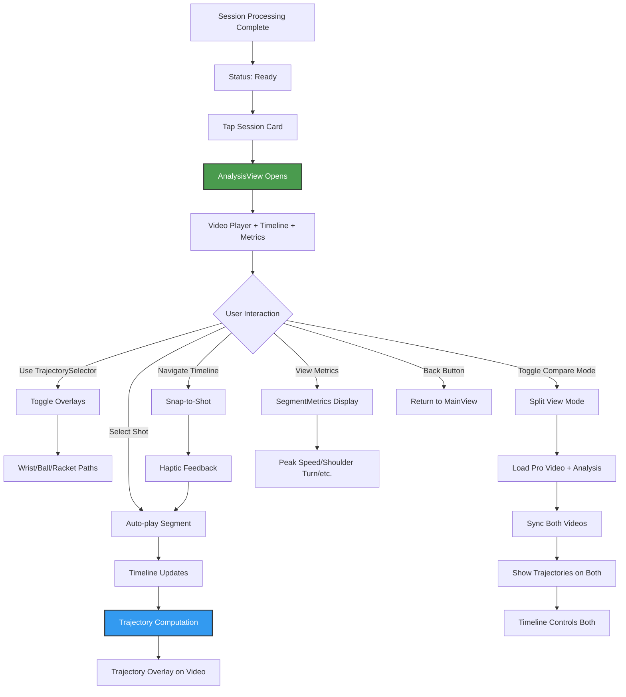

# Tennis App - User Flow & UI Screens (v2.0)

## Current Implementation Flow


---

## Screen Designs

### 1. MAINVIEW - Single Dashboard (Root View)

```
┌──────────────────────────────────────────┐
│                                          │
│  Victor • USTR 3.5 → 4.0                │
│  ▣                                       │
│                                          │
│  ╔══════════════════════════════════╗    │
│  ║ ✨ AI Coach Insight   [Forehand] ║    │
│  ║                                  ║    │
│  ║ Your contact point is moving    ║    │
│  ║ forward nicely. Keep working →  ║    │
│  ╚══════════════════════════════════╝    │
│       ━━━━━━━━━━━━━━━━━━━━━          │
│            ████░░░░░░                    │
│         (Page 1 of 3)                    │
│                                          │
│  Recent Sessions                         │
│  ┌────────────────────────────────────┐  │
│  │  [Video Thumbnail 200pt]           │  │
│  │  ⟳ Detecting swings...             │  │ ← Processing overlay
│  │  Today 2:30 PM                     │  │
│  └────────────────────────────────────┘  │
│                                          │
│  ┌────────────────────────────────────┐  │
│  │  [Video Thumbnail 200pt]           │  │
│  │  ✓ Ready • 7.2 avg • 5 shots      │  │ ← Complete session
│  │  Yesterday 4:15 PM                 │  │
│  └────────────────────────────────────┘  │
│                                          │
│                    [ ⊕ ]                 │ ← Floating button (64pt)
└──────────────────────────────────────────┘

Components:
- Profile header with avatar
- Coach insights carousel (horizontal swipe)
- Video session cards with inline status
- Floating action button (bottom-right)
```

**Key Features:**
- Single scrollable view
- Non-blocking processing status
- Video thumbnails update based on selected shot
- Glass morphism effects on cards

---

### 2. CAMERA VIEW

```
┌──────────────────────────────────────────┐
│  [🚶] [🎾]                              │ ← Toggle overlays
│         [Live Camera Feed]               │
│                                          │
│      [Skeleton Overlay Active]           │
│      [Green/Yellow/Red joints]           │
│                                          │
│      [Ball Detection Boxes] 🟡           │
│      [Racket Detection Boxes] 🎾         │
│                                          │
│  ● 1:23  •  8.2 fps                     │ ← Recording indicator
│                                          │
├──────────────────────────────────────────┤
│                                          │
│           ╔══════════╗     ╔═══════╗     │
│           ║  START   ║     ║  END  ║     │
│           ╚══════════╝     ╚═══════╝     │
│                                          │
│         (START/PAUSE/RESUME + END)       │
│                                          │
└──────────────────────────────────────────┘

States:
- START → Records (green), shows PAUSE + END
- PAUSE → Shows RESUME + END  
- RESUME → Back to recording
- END → Stops and processes
- Real-time overlays: Skeleton + Ball + Racket detection
- YOLO11-based object detection with confidence indicators
- Toggle buttons for skeleton and object overlays
- Returns to MainView immediately after END
```

---

### 3. ANALYSIS VIEW (Post-Processing Only)

```
┌──────────────────────────────────────────┐
│ ←                                        │
├──────────────────────────────────────────┤
│  ╔════════════════════════════════════╗  │ ← Compact metrics bar (overlay on video)
│  ║ FOREHAND • ⚡15 • 🔄120° • 🎯85%  ║  │
│  ║                            ⌄     ║  │
│  ╚════════════════════════════════════╝  │
│                                          │
│         [Full-Screen Video Player]       │
│                                          │
│      [Trajectory Overlay on video]       │
│      [Ball/Racket/Wrist paths] 🟡───🟡   │
│      [Auto-computed on shot selection]   │
│                                          │
│                                          │
│                                          │
│                                          │
│                                          │
│                                          │
│                                          │
│                                          │
│  ╔════════════════════════════════════╗  │ ← Unified bottom control panel
│  ║ [Racket][Wrist][Off] | Compare ○   ║  │ ← Trajectory selector + Compare toggle
│  ║ ────────────────────────────────────  ║  │ ← Subtle divider
│  ║ ◀ ──●────◇──●──◎──●────◇────●──── ▶  ║  │ ← Timeline with nav buttons
│  ║     FH    BH  FH  FH   BH    FH      ║  │
│  ╚════════════════════════════════════╝  │
└──────────────────────────────────────────┘

Features:
- Full-screen immersive video experience
- Overlay-based UI with minimal obstruction
- Compact metrics bar at top (expandable to detailed grid)
- Unified glass bottom panel with trajectory selector + timeline
- TrajectorySelector with segmented control (Racket/Wrist/Off) + Compare toggle
- TimelineStripEnhanced with integrated prev/next arrows
- Markers expand in-place to show segment details with progress
- On-demand trajectory computation from persisted pose/object data
- Auto-play segments when shots are selected
- Magnetic snapping and haptic feedback
- Single trajectory visualization (no multi-select)
- Glass morphism styling throughout
```

#### Compare Mode (Split View)
```
┌──────────────────────────────────────────┐
│ ←                                        │
├──────────────────────────────────────────┤
│  ╔════════════════════════════════════╗  │ ← Compact metrics bar (overlay on video)
│  ║ FOREHAND • ⚡15 • 🔄120° • 🎯85%  ║  │
│  ║                            ⌄     ║  │
│  ╚════════════════════════════════════╝  │
│                                          │
│ ┌───────────────────┬────────────────────┐│ ← Split video view (1px gap)
│ │  YOU              │  PRO               ││
│ │                   │                    ││
│ │ [User Video]      │ [Pro Video]        ││
│ │ 🟡───🟡           │ 🟡───🟡            ││ ← Synchronized trajectories
│ │ Trajectory        │ Trajectory         ││
│ │ overlay           │ overlay            ││
│ │                   │                    ││
│ └───────────────────┴────────────────────┘│
│                                          │
│                                          │
│  ╔════════════════════════════════════╗  │ ← Unified bottom control panel
│  ║ [Racket][Wrist][Off] | Compare ●   ║  │ ← Trajectory selector + Compare toggle (ON)
│  ║ ────────────────────────────────────  ║  │ ← Subtle divider
│  ║ ◀ ──●────◇──●──◎──●────◇────●──── ▶  ║  │ ← Timeline controls user video
│  ║     FH    BH  FH  FH   BH    FH      ║  │
│  ╚════════════════════════════════════╝  │
└──────────────────────────────────────────┘
```

**Compare Mode Features:**
- Side-by-side split view with user video (left) and pro video (right)
- Time synchronization: Pro video plays in sync with user's selected shot
- Video labels: "YOU" and "PRO" overlay on respective videos
- Trajectory sync: Both videos show same trajectory type when enabled
- Single timeline controls both videos
- Compare toggle in trajectory selector enables/disables split view
- Pro video loads pre-analyzed shot data from bundled resources

---

### 4. RECORD OPTIONS MODAL

```
┌──────────────────────────────────────────┐
│                                          │
│     ╔════════════════════════════╗       │
│     ║                            ║       │
│     ║   How do you want to      ║       │
│     ║   add a swing?             ║       │
│     ║                            ║       │
│     ║  ┌──────────────────────┐ ║       │
│     ║  │   📹 Record Now      │ ║       │
│     ║  └──────────────────────┘ ║       │
│     ║                            ║       │
│     ║  ┌──────────────────────┐ ║       │
│     ║  │   📁 Upload Video    │ ║       │
│     ║  └──────────────────────┘ ║       │
│     ║                            ║       │
│     ╚════════════════════════════╝       │
│                                          │
│            [Tap to dismiss]              │
└──────────────────────────────────────────┘

Glass modal with two options only
```

---

### 5. COACH DETAIL VIEW

```
┌──────────────────────────────────────────┐
│ ←                                        │
├──────────────────────────────────────────┤
│                                          │
│  ╔════════════════════════════════════╗  │
│  ║ [Forehand]                         ║  │
│  ║                                    ║  │
│  ║ Late Contact Point                 ║  │
│  ║ ─────────────────────────────────  ║  │
│  ║                                    ║  │
│  ║ ## 👋 Hey Victor!                  ║  │
│  ║                                    ║  │
│  ║ I watched your last 5 sessions -   ║  │
│  ║ your grip and stance? *Chef's      ║  │
│  ║ kiss* 👨‍🍳                          ║  │
│  ║                                    ║  │
│  ║ ## 🎯 The Real Issue               ║  │
│  ║                                    ║  │
│  ║ You're making contact **0.3        ║  │
│  ║ seconds late**. That's the         ║  │
│  ║ difference between a rocket        ║  │
│  ║ and a push...                      ║  │
│  ║                                    ║  │
│  ║ [Scrollable markdown content]      ║  │
│  ╚════════════════════════════════════╝  │
│                                          │
│  ┌────────────────────────────────────┐  │
│  │ ▶ Watch Video Tutorial             │  │
│  └────────────────────────────────────┘  │
│                                          │
└──────────────────────────────────────────┘

Single glass card with unified content
Optional video link at bottom
```

---

## Processing Status States

### VideoSessionCard Status Overlays

```
PENDING
┌────────────────────────┐
│ [Blurred Thumbnail]    │
│ ⟳ Preparing...         │
└────────────────────────┘

EXTRACTING POSES
┌────────────────────────┐
│ [Blurred Thumbnail]    │
│ ⟳ Detecting motion     │
│ ▓▓▓▓░░░░░░ 40%        │
└────────────────────────┘

CALCULATING METRICS
┌────────────────────────┐
│ [Blurred Thumbnail]    │
│ ⟳ Computing metrics    │
└────────────────────────┘

DETECTING SWINGS
┌────────────────────────┐
│ [Blurred Thumbnail]    │
│ ⟳ Finding swings       │
└────────────────────────┘

VALIDATING SWINGS
┌────────────────────────┐
│ [Blurred Thumbnail]    │
│ ⟳ Validating 2/5       │
└────────────────────────┘

COMPLETE
┌────────────────────────┐
│ [Clear Thumbnail]      │
│ ✓ Ready • 7.2 • 5 shots│
└────────────────────────┘

FAILED
┌────────────────────────┐
│ [Blurred Thumbnail]    │
│ ⚠️ Failed • [Retry]     │
└────────────────────────┘
```

---

## Interaction Patterns

### Recording Flow

```mermaid
flowchart TD
    A[MainView] --> B[Tap Floating Button]
    B --> C[RecordOptionsModal Opens]
    C --> D[Choose Record Now]
    D --> E[CameraView Opens]
    E --> F[Real-time Overlays Active]
    F --> G[Skeleton + Ball + Racket Detection]
    G --> H[Tap START Button]
    H --> I[Recording Begins]
    I --> J{During Recording}
    J -->|Can Pause| K[Tap PAUSE]
    K --> L[Tap RESUME]
    L --> I
    J -->|Finish| M[Tap END]
    M --> N[Processing Overlay]
    N --> O[Return to MainView]
    O --> P[New Session Card Appears]
    P --> Q[Background Processing Pipeline]
    Q --> R[Status Updates: Poses → Metrics → Swings → Validation]
    
    style E fill:#4A9B4E,stroke:#333,stroke-width:2px,color:#fff
    style I fill:#339af0,stroke:#333,stroke-width:2px,color:#fff
```



### Upload Flow

```mermaid
flowchart TD
    A[MainView] --> B[Tap Floating Button]
    B --> C[RecordOptionsModal Opens]
    C --> D[Choose Upload Video]
    D --> E[Photos Picker Opens]
    E --> F[Select Video File]
    F --> G[Return to MainView]
    G --> H[New Session Card Appears]
    H --> I[Background Processing Pipeline]
    I --> J[Status Updates: Poses → Metrics → Swings → Validation]
    
    style E fill:#4A9B4E,stroke:#333,stroke-width:2px,color:#fff
    style I fill:#339af0,stroke:#333,stroke-width:2px,color:#fff
```



### Analysis Navigation



### Coach Insights Flow


---
