# Video Processing Architecture - Complete Technical Guide

## Executive Summary

The SwingMaster video processing pipeline transforms tennis swing videos into actionable coaching insights through a sophisticated multi-stage analysis system. The pipeline combines Apple's Vision framework for body pose detection, YOLO11 CoreML for object detection (tennis balls and rackets), custom swing detection algorithms, and AI validation to deliver comprehensive swing analysis.

## Video Processing File Architecture

```
swingmaster/
├── Core/                                   [Video Processing Pipeline]
│   ├── VideoProcessor.swift               # Main orchestrator - coordinates entire pipeline
│   ├── PoseProcessor.swift                # Vision framework - extracts body joints
│   ├── TennisObjectDetector.swift         # YOLO11 - detects balls/rackets
│   ├── SwingDetector.swift                # Identifies swing boundaries
│   ├── MetricsCalculator.swift            # Computes kinematic metrics
│   └── GeminiValidator.swift              # AI validation of swings
│
├── Managers/                               [Processing & Storage]
│   ├── ProcessingManager.swift            # Singleton - manages concurrent processing
│   ├── AnalysisStore.swift                # Persistence of analysis results
│   └── VideoStorage.swift                 # File management & thumbnails
│
├── Models/                                 [Processing Data Structures]
│   ├── PoseFrame.swift                    # Normalized pose data (17 joints)
│   ├── ObjectDetection.swift              # YOLO detection results
│   ├── SwingSegment.swift                 # Detected swing boundaries
│   ├── AnalysisResult.swift               # Complete analysis package
│   ├── Shot.swift                         # UI-friendly shot model
│   ├── SegmentMetrics.swift               # Swing metrics data
│   └── ValidatedSwing.swift               # AI-validated swing data
│
├── Utils/                                  [Processing Utilities]
│   ├── TrajectoryComputer.swift           # On-demand trajectory computation
│   └── FrameBuffer.swift                  # Circular buffer for frames
│
└── yolo11l.mlpackage/                     [ML Model]
    └── (YOLO11 CoreML model ~50MB)        # Tennis object detection model
```

### File Interaction Map


## System Overview

```mermaid
flowchart TB
    subgraph "Input Sources"
        CAM[📹 Camera Recording]
        UPLOAD[📁 Video Upload]
    end
    
    subgraph "Processing Pipeline"
        PM[ProcessingManager<br/>Orchestrator]
        VP[VideoProcessor<br/>Main Pipeline]
        
        subgraph "Core Processing Stages"
            POSE[PoseProcessor<br/>Body Detection]
            OBJ[TennisObjectDetector<br/>Ball/Racket Detection]
            SWING[SwingDetector<br/>Motion Patterns]
            METRICS[MetricsCalculator<br/>Kinematics]
            VALID[GeminiValidator<br/>AI Validation]
        end
    end
    
    subgraph "Storage & UI"
        STORE[AnalysisStore<br/>Persistence]
        SESSION[SessionStore<br/>State Management]
        UI[AnalysisView<br/>Visualization]
    end
    
    CAM --> PM
    UPLOAD --> PM
    PM --> VP
    VP --> POSE
    VP --> OBJ
    POSE --> SWING
    SWING --> METRICS
    METRICS --> VALID
    VALID --> STORE
    STORE --> SESSION
    SESSION --> UI
    
    style VP fill:#4A9B4E,stroke:#333,stroke-width:2px,color:#fff
    style PM fill:#339af0,stroke:#333,stroke-width:2px,color:#fff
    style VALID fill:#F7DC6F,stroke:#333,stroke-width:2px
```



---

## Detailed Processing Flow

### Stage 1: Video Input & Session Creation


**Key Points:**
- Session created immediately (non-blocking)
- Video appears in UI instantly with "Processing" status
- Thumbnail generation runs asynchronously
- Maximum 2 concurrent processing operations

**Files:**
- `ContentView.swift`: Handles video creation flow
- `CameraView.swift`: Records video with live overlays
- `SessionStore.swift`: Manages session state
- `VideoStorage.swift`: File management & thumbnails

---

### Stage 2: Pose & Object Extraction


**Technical Details:**
- **FPS Detection**: Reads native video frame rate (typically 30fps for iOS)
- **Orientation Handling**: Detects portrait/landscape from video transform
- **Pose Extraction**: 
  - 17 joint points per frame (Vision framework)
  - Normalized coordinates (0-1)
  - Confidence scores per joint
- **Object Detection**:
  - YOLO11 model (~50MB)
  - Detects tennis balls and rackets
  - Bounding boxes with confidence scores
  - Runs on-device via CoreML

**Files:**
- `VideoProcessor.swift`: Orchestrates extraction (lines 38-77)
- `PoseProcessor.swift`: Vision framework integration
- `TennisObjectDetector.swift`: YOLO11 implementation
- `Models/PoseFrame.swift`: Pose data structure
- `Models/ObjectDetection.swift`: Detection results

---

### Stage 3: Swing Detection & Analysis


**Algorithm Details:**
- **Metrics Calculation**:
  - Angular velocity from joint movements
  - Linear velocity tracking
  - Smoothing with 3-frame window
- **Swing Detection**:
  - State machine: Idle → Active → Cooldown
  - Threshold: 2.0 rad/s angular velocity
  - Minimum 10 frames for valid swing
- **Segment Padding**:
  - Adds 0.5s before/after swing
  - Captures approach and follow-through
  - Essential for trajectory visualization

**Files:**
- `MetricsCalculator.swift`: Kinematic computations
- `SwingDetector.swift`: Peak detection algorithm
- `Models/SwingSegment.swift`: Swing boundaries

---

### Stage 4: AI Validation & Classification


**Validation Features:**
- **AI Classification**: Gemini API validates swing type
- **Confidence Scoring**: 0.0 to 1.0 confidence
- **Boundary Refinement**: Adjusts start/end frames

**Files:**
- `GeminiValidator.swift`: AI validation logic
- `Models/AnalysisResult.swift`: Final results

---

### Stage 5: Results Storage & UI Presentation


**Storage Strategy:**
- **AnalysisResult**: Complete analysis with padded frames
- **Shot Model**: Simplified for UI with metrics
- **Persistence**: UserDefaults (MVP), Core Data (future)
- **Trajectory Data**: Stored for on-demand computation

**Files:**
- `ProcessingManager.swift`: Results packaging (lines 86-110)
- `AnalysisStore.swift`: Persistence layer
- `AnalysisView.swift`: Main analysis UI
- `TrajectoryOverlay.swift`: Motion visualization

---

## Processing States & User Feedback


**Status Messages:**
- `Pending`: "Preparing..."
- `ExtractingPoses`: "Detecting motion" (0-50% progress)
- `DetectingObjects`: "Finding objects" (50-100% progress)
- `CalculatingMetrics`: "Calculating metrics"
- `DetectingSwings`: "Finding swings"
- `ValidatingSwings`: "Validating 2/5" (shows progress)
- `Complete`: "Ready"
- `Failed`: "Failed: [error]" with retry option

---

## Key Technical Components

### 1. Frame Rate Handling
```swift
// VideoProcessor.swift - Dynamic FPS detection
private func getVideoFPS(from url: URL) -> Double? {
    let asset = AVAsset(url: url)
    guard let videoTrack = asset.tracks(withMediaType: .video).first else {
        return nil
    }
    return Double(videoTrack.nominalFrameRate)  // Native FPS
}
```

### 2. Orientation Detection
```swift
// VideoProcessor.swift - Handle portrait/landscape
private func getVideoOrientation(from url: URL) -> CGImagePropertyOrientation {
    // Analyzes video transform matrix
    // Maps to correct orientation for processing
}
```

### 3. Segment Padding
```swift
// VideoProcessor.swift - Extract with padding
private func extractPaddedSegmentData(
    swing: ValidatedSwing,
    allPoseFrames: [PoseFrame],
    allObjectFrames: [ObjectDetectionFrame],
    paddingSeconds: Double = 0.5  // ± 0.5 seconds
)
```

### 4. Concurrent Processing
```swift
// ProcessingManager.swift - Queue management
private let maxConcurrentProcessing = 2
private var pendingQueue: [(Session, URL)] = []
```

---

## Data Models & Flow

### Core Data Structures


---

## Performance Optimizations

### 1. Memory Management
- **Frame Buffering**: Fixed-size circular buffers
- **Segment Extraction**: Only relevant frames kept
- **Lazy Loading**: Trajectories computed on-demand

### 2. Processing Efficiency
- **Native FPS**: Uses video's actual frame rate
- **Parallel Processing**: Pose and object detection run together
- **Queue Management**: Max 2 concurrent videos
- **Background Execution**: Non-blocking UI

### 3. Storage Strategy
- **Padded Frames**: ±0.5s for full motion capture
- **Compressed Storage**: UserDefaults with JSON encoding
- **Thumbnail Caching**: Async generation and persistence

---

## Error Handling & Recovery

### Error Types & Recovery

| Error Type | Recovery Strategy | User Feedback |
|------------|------------------|---------------|
| Pose Detection Fail | Retry with lower FPS | "Motion detection unavailable" |
| Object Detection Fail | Continue without objects | "Ball/racket tracking unavailable" |
| No Swings Found | Show video only | "No swings detected" |
| Validation Timeout | Skip validation | "Using basic analysis" |
| Storage Full | Clear old sessions | "Storage limit reached" |

### Retry Mechanism
```swift
// ProcessingManager.swift
func retryProcessing(for session: Session, sessionStore: SessionStore) {
    guard session.retryCount < session.maxRetries else { return }
    // Exponential backoff retry logic
}
```

---

## Quick Reference Guide

### File Responsibilities

| Component | File | Primary Function |
|-----------|------|------------------|
| Orchestration | `ProcessingManager.swift` | Queue management, state updates |
| Main Pipeline | `VideoProcessor.swift` | Coordinates all analysis stages |
| Pose Detection | `PoseProcessor.swift` | Vision framework, body joints |
| Object Detection | `TennisObjectDetector.swift` | YOLO11 ball/racket detection |
| Swing Detection | `SwingDetector.swift` | Motion pattern analysis |
| Metrics | `MetricsCalculator.swift` | Kinematic calculations |
| Validation | `GeminiValidator.swift` | AI swing classification |
| Storage | `AnalysisStore.swift` | Result persistence |
| UI | `AnalysisView.swift` | Result visualization |

### Processing Timeline


---

## Conclusion

The SwingMaster video processing architecture represents a sophisticated pipeline that transforms raw video into actionable tennis coaching insights. By combining on-device AI (Vision + YOLO11), custom motion algorithms, and cloud validation, the system delivers professional-grade analysis while maintaining responsive performance and user privacy.

The architecture's strength lies in its:
- **Non-blocking design**: Users see immediate feedback
- **Modular pipeline**: Each stage can be independently improved
- **Intelligent caching**: Trajectories computed on-demand
- **Robust error handling**: Graceful degradation and retry logic
- **Scalable storage**: From UserDefaults (MVP) to Core Data (future)

This document serves as the authoritative reference for understanding, maintaining, and extending the video processing system.