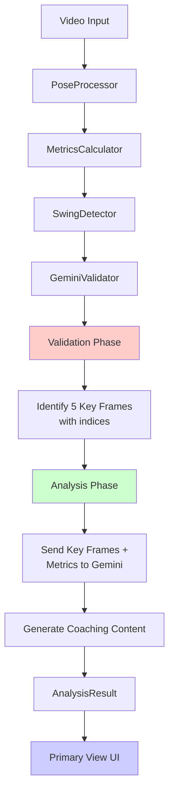

# Tennis App - Simplified Coaching Analysis Implementation Plan

## Overview

Add balanced coaching feedback to the app with a simplified, LLM-friendly data structure. The implementation clearly separates validation (identifying key frames) from analysis (generating coaching content).

## Architecture Flow



## Key Design Principles

1. **Clear Phase Separation**: Validation identifies frames, Analysis generates content
2. **Simple Data Structure**: Just strengths and improvements, no complex nested objects
3. **LLM-Friendly**: Let Gemini generate natural language without forcing rigid structure
4. **Minimal MVP**: Focus on primary view only, no expanded view yet

---

## Data Model Updates

### Enhanced AnalysisResult
Location: `Models/AnalysisResult.swift`

```swift
public struct AnalysisResult: Sendable, Identifiable {
    public var id: UUID
    public var segment: SwingSegment
    public var swingType: SwingType
    public var score: Float
    
    // NEW: Simplified coaching feedback
    public var strengths: [String]      // 2-3 things done well
    public var improvements: [String]   // 2-3 areas to improve (first is primary)
    
    // NEW: Key frame references (for future use)
    public var keyFrames: [KeyFrame]
}

// Simplified key frame - just for tracking, not for content
public struct KeyFrame: Sendable {
    public let type: KeyFrameType
    public let frameIndex: Int        // Index in original frames array
    public let timestamp: TimeInterval
}

public enum KeyFrameType: String, Sendable {
    case preparation = "Preparation"
    case backswing = "Backswing"  
    case contact = "Contact"
    case followThrough = "Follow-through"
    case recovery = "Recovery"
}
```

---

## Phase 1: Update Validation (2-3 hours)

### Goal
Modify GeminiValidator to identify key frames during validation, but NOT generate coaching content yet.

### Implementation

#### 1.1 Update Validation Method
Location: `Core/GeminiValidator.swift`

```swift
func validateSwing(_ potential: PotentialSwing) async throws -> ValidatedSwing? {
    // 1. Convert 30 frames to base64 images
    let images = try await prepareImages(from: potential.frames)
    
    // 2. Validation prompt - just identify key moments
    let prompt = """
    Analyze these 30 frames showing a potential tennis swing.
    The peak motion occurs at frame \(potential.peakFrameIndex).
    
    Tasks:
    1. Confirm if this is a valid tennis swing
    2. Identify exact start/end frames
    3. Classify swing type
    4. Identify the frame index for each key moment:
       - Preparation stance
       - Peak of backswing
       - Ball contact
       - Maximum follow-through
       - Recovery position
    
    Return JSON:
    {
        "is_valid_swing": boolean,
        "swing_type": "forehand|backhand|serve|unknown",
        "start_frame": number,
        "end_frame": number,
        "confidence": number,
        "key_frames": {
            "preparation": number,
            "backswing": number,
            "contact": number,
            "follow_through": number,
            "recovery": number
        }
    }
    """
    
    // 3. Parse response
    let response = try await callGeminiAPI(images: images, prompt: prompt)
    guard let validation = parseValidationResponse(response),
          validation.isValid else { return nil }
    
    // 4. Create ValidatedSwing with key frame indices
    return ValidatedSwing(
        frames: Array(potential.frames[validation.startFrame...validation.endFrame]),
        type: validation.swingType,
        confidence: validation.confidence,
        keyFrameIndices: validation.keyFrames
    )
}
```

---

## Phase 2: Update Analysis (3-4 hours)

### Goal
Modify analysis to use identified key frames and generate simple, natural coaching feedback.

### Implementation

#### 2.1 Update Analysis Method
Location: `Core/GeminiValidator.swift`

```swift
func analyzeSwing(_ swing: ValidatedSwing, 
                  metrics: SegmentMetrics) async throws -> AnalysisResult {
    
    // 1. Extract the 5 key frames using indices from validation
    let keyFrames = extractKeyFrames(swing)
    let keyImages = try await prepareImages(from: keyFrames.map { $0.frame })
    
    // 2. Simple, natural language prompt
    let prompt = """
    Analyze this \(swing.type) tennis swing.
    
    Context:
    - Peak angular velocity: \(String(format: "%.2f", metrics.peakAngularVelocity)) rad/s
    - Peak linear velocity: \(String(format: "%.2f", metrics.peakLinearVelocity)) m/s
    - Contact point: X=\(metrics.contactPoint.x), Y=\(metrics.contactPoint.y)
    - Shoulder rotation: \(String(format: "%.1f", metrics.backswingAngle))°
    
    You're seeing 5 key moments:
    1. Preparation stance
    2. Peak backswing
    3. Ball contact
    4. Maximum follow-through
    5. Recovery position
    
    Provide coaching feedback like a friendly tennis coach would:
    - 2-3 specific things the player did well
    - 2-3 specific improvements (most important first)
    - Overall form score (0-10)
    
    Be encouraging but honest. Use simple language a recreational player understands.
    
    Return JSON:
    {
        "score": number,
        "strengths": [
            "specific positive observation",
            "another strength"
        ],
        "improvements": [
            "most important fix with how to do it",
            "secondary improvement with instruction"
        ]
    }
    """
    
    // 3. Get response and parse
    let response = try await callGeminiAPI(images: keyImages, prompt: prompt)
    let analysis = parseAnalysisResponse(response)
    
    // 4. Create AnalysisResult
    return AnalysisResult(
        id: UUID(),
        segment: swing.segment,
        swingType: swing.type,
        score: analysis.score,
        strengths: analysis.strengths,
        improvements: analysis.improvements,
        keyFrames: keyFrames.map { kf in
            KeyFrame(
                type: kf.type,
                frameIndex: kf.index,
                timestamp: kf.frame.timestamp
            )
        }
    )
}

private func extractKeyFrames(_ swing: ValidatedSwing) -> [(type: KeyFrameType, index: Int, frame: PoseFrame)] {
    // Use indices from validation to extract actual frames
    return [
        (.preparation, swing.keyFrameIndices.preparation, swing.frames[swing.keyFrameIndices.preparation]),
        (.backswing, swing.keyFrameIndices.backswing, swing.frames[swing.keyFrameIndices.backswing]),
        (.contact, swing.keyFrameIndices.contact, swing.frames[swing.keyFrameIndices.contact]),
        (.followThrough, swing.keyFrameIndices.followThrough, swing.frames[swing.keyFrameIndices.followThrough]),
        (.recovery, swing.keyFrameIndices.recovery, swing.frames[swing.keyFrameIndices.recovery])
    ]
}
```

---

## Phase 3: Update Primary View UI (2-3 hours)

### Goal
Create a clean, balanced coaching card showing strengths and improvements.

### Implementation

#### 3.1 Enhanced Insight Card
Location: `Views/AnalysisView.swift`

```swift
private var enhancedInsightCard: some View {
    let selected = shots.first(where: { $0.id == selectedShotID })
    
    return VStack(alignment: .leading, spacing: 14) {
        // Header
        HStack {
            Text(selected?.type.accessibleName ?? "Shot")
                .font(.system(size: 17, weight: .bold))
            Spacer()
            // Score with color coding
            Text(String(format: "%.1f", selected?.score ?? 0))
                .font(.system(size: 28, weight: .bold, design: .monospaced))
                .foregroundColor(scoreColor(selected?.score ?? 0))
        }
        .padding(.bottom, 4)
        
        // Strengths section
        if let strengths = selected?.strengths, !strengths.isEmpty {
            VStack(alignment: .leading, spacing: 8) {
                Label("What you did well", systemImage: "checkmark.circle.fill")
                    .font(.system(size: 13, weight: .semibold))
                    .foregroundColor(.green)
                
                ForEach(strengths, id: \.self) { strength in
                    HStack(alignment: .top, spacing: 8) {
                        Circle()
                            .fill(Color.green)
                            .frame(width: 4, height: 4)
                            .offset(y: 6)
                        Text(strength)
                            .font(.system(size: 15))
                            .foregroundColor(.white)
                            .fixedSize(horizontal: false, vertical: true)
                    }
                }
            }
        }
        
        Divider()
            .background(Color.white.opacity(0.1))
        
        // Improvements section
        if let improvements = selected?.improvements, !improvements.isEmpty {
            VStack(alignment: .leading, spacing: 8) {
                Label("Focus on improving", systemImage: "arrow.triangle.2.circlepath")
                    .font(.system(size: 13, weight: .semibold))
                    .foregroundColor(.yellow)
                
                ForEach(Array(improvements.enumerated()), id: \.offset) { index, improvement in
                    HStack(alignment: .top, spacing: 8) {
                        // Highlight first improvement as primary
                        Circle()
                            .fill(index == 0 ? Color.yellow : Color.yellow.opacity(0.6))
                            .frame(width: 4, height: 4)
                            .offset(y: 6)
                        Text(improvement)
                            .font(.system(size: 15, weight: index == 0 ? .medium : .regular))
                            .foregroundColor(.white.opacity(index == 0 ? 1 : 0.9))
                            .fixedSize(horizontal: false, vertical: true)
                    }
                }
            }
        }
    }
    .padding(18)
    .background(.ultraThinMaterial)
    .overlay(
        RoundedRectangle(cornerRadius: 12)
            .stroke(Color.white.opacity(0.15), lineWidth: 1)
    )
    .clipShape(RoundedRectangle(cornerRadius: 12))
}

private func scoreColor(_ score: Float) -> Color {
    if score >= 7.5 { return .green }
    if score >= 5.5 { return .yellow }
    return .orange
}
```

#### 3.2 Temporary MockShot Extension
Location: `Models/Shot.swift`

```swift
// Temporary properties until real data flows through
extension MockShot {
    var strengths: [String]? {
        // Will be populated from AnalysisResult
        return ["Good shoulder rotation through the ball", 
                "Maintained balance during follow-through"]
    }
    
    var improvements: [String]? {
        // Will be populated from AnalysisResult  
        return ["Hit the ball 6 inches earlier - start your swing when the ball crosses the service line",
                "Transfer weight to your front foot before contact"]
    }
}
```

---

## Phase 4: Wire Everything Together (2 hours)

### Goal
Connect the enhanced analysis data from VideoProcessor to the UI.

### Implementation

#### 4.1 Update VideoProcessor Mapping
Location: `Core/VideoProcessor.swift`

```swift
// In processVideo method, after getting AnalysisResult:
private func mapToDisplayData(_ results: [AnalysisResult]) -> [MockShot] {
    return results.map { result in
        MockShot(
            id: result.id,
            time: result.segment.startTime + (result.segment.endTime - result.segment.startTime) / 2,
            type: result.swingType == .forehand ? .forehand : .backhand,
            score: result.score,
            issue: result.improvements.first ?? "", // Primary improvement
            startTime: result.segment.startTime,
            endTime: result.segment.endTime,
            // Pass through coaching data
            strengths: result.strengths,
            improvements: result.improvements
        )
    }
}
```

#### 4.2 Update AnalysisView
Location: `Views/AnalysisView.swift`

```swift
// Replace existing insightCard with enhancedInsightCard
var body: some View {
    VStack {
        // ... video player ...
        // ... timeline ...
        // ... chips row ...
        
        enhancedInsightCard  // Use the new card
            .padding(.horizontal, 16)
            .padding(.top, 4)
        
        Spacer(minLength: 0)
    }
}
```

---

## Testing Plan

### Validation Phase
- Verify key frame indices are identified correctly
- Check that no coaching content is generated during validation
- Ensure frame indices map to meaningful moments

### Analysis Phase  
- Confirm Gemini generates natural, helpful feedback
- Verify strengths are positive and specific
- Check improvements include actionable instructions
- Test score generation is reasonable

### UI Integration
- Verify strengths and improvements display correctly
- Check primary improvement is visually emphasized
- Test with missing data (no improvements, etc.)
- Confirm accessibility labels work

---

## Success Metrics

1. **Clarity**: Users understand what they did well and what to fix
2. **Balance**: Always shows positives alongside improvements
3. **Actionable**: Each improvement includes HOW to fix it
4. **Natural**: Feedback reads like a human coach wrote it
5. **Simple**: Data structure is easy for LLMs to populate

---

## Benefits of This Approach

1. **Clean Separation**: Validation finds moments, analysis generates content
2. **LLM-Friendly**: Simple JSON structure that Gemini can easily populate
3. **Natural Language**: Coaching feedback isn't forced into rigid templates
4. **Minimal MVP**: Focused on primary view without complexity
5. **Future-Ready**: Key frames identified for later visual overlays

The simplified structure makes it easier for Gemini to generate natural, helpful coaching feedback while keeping the codebase clean and maintainable.