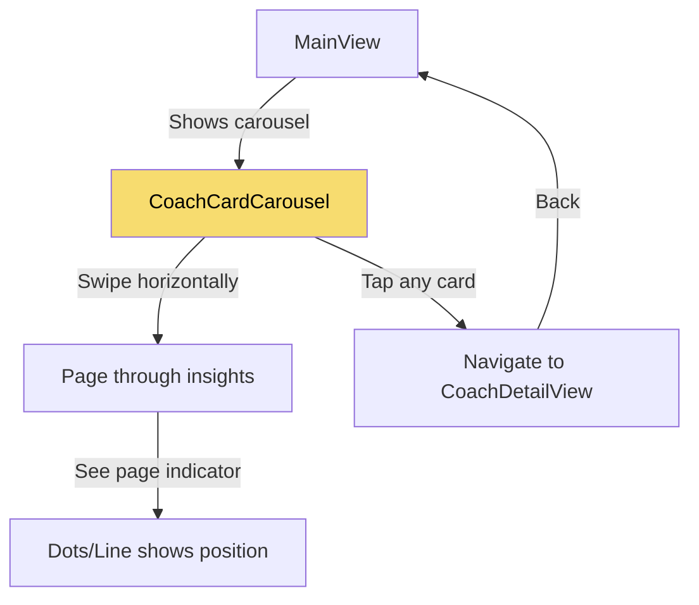

# Coach Card Carousel Implementation Plan

## Phase 0: Data Models & Mock Data

### 0.1 CoachInsight Model
**Purpose**: Define the data structure for coach insights

```swift
// Models/CoachInsight.swift

struct CoachInsight: Identifiable {
    let id = UUID()
    let tag: String                 // "Forehand", "Footwork", "Timing", etc.
    let issueTitle: String          // "Late Contact Point"
    let trend: Trend               // .improving
    let shortDescription: String    // For carousel card
    let markdownContent: String     // Full advice for detail view
    let videoReference: VideoRef?   // Optional YouTube link
}

enum Trend: String {
    case improving = "↗️"
    case stable = "→"
    case declining = "↘️"
}

struct VideoRef {
    let youtubeId: String
    let timestamp: Int      // seconds
    let title: String
}
```

### 0.2 Mock Data
**Purpose**: Sample data for development and testing (now written in a human, coach-like voice)

```swift
// Mock/MockCoachData.swift

struct MockCoachData {
    static let insights = [
        CoachInsight(
            tag: "Forehand",
            issueTitle: "Late Contact Point",
            trend: .improving,
            shortDescription: "Your contact point is moving forward nicely. Keep working on hitting out in front",
            markdownContent: """
            ## 👋 Hey Victor!
            
            I watched your last 5 sessions - your grip and stance? *Chef's kiss* 👨‍🍳
            
            But here's the thing...
            
            ## 🎯 The Real Issue
            
            You're making contact **0.3 seconds late**. That's the difference between a rocket and a push.
            
            Think of it this way: Late contact is like trying to slam a revolving door after someone's already through it. All that beautiful kinetic chain you've built? Wasted.
            
            ## 💪 Your 15-Minute Fix
            
            ### Drill 1: The "HIT!" Method (2 mins)
            - Take your stance
            - Swing in slow motion
            - YELL "HIT!" when your arm is fully extended in front
            - Repeat 10 times (neighbors will think you're crazy, but your forehand will thank you)
            
            ### Drill 2: The Drop & Pop (5 mins)
            - Drop a ball from shoulder height
            - Let it bounce once
            - Hit it at hip level with full extension
            - Listen for that addictive "POP!" sound
            - Miss the sound? Adjust and try again
            
            ### Drill 3: Wall Rally Challenge (8 mins)
            - Stand 10 feet from a wall
            - Rally against it focusing ONLY on contact point
            - Goal: 20 consecutive hits with perfect contact
            - Pro tip: Tape your front‑foot spot on the ground
            
            ## ✅ You'll Know It's Working When...
            ✓ See your hitting hand at contact
            ✓ Weight shifts to front foot
            ✓ Ball makes a crisp "crack" sound
            ✓ More pace with less effort
            
            ## 🔥 Coach's Note
            You're closer than you think. One good session and this clicks forever. Let's get after it! 🎾
            """,
            videoReference: VideoRef(
                youtubeId: "dQw4w9WgXcQ",
                timestamp: 142,
                title: "Fix Late Contact - Tennis Timing Drill"
            )
        ),
        
        CoachInsight(
            tag: "Footwork",
            issueTitle: "Split Step Timing",
            trend: .stable,
            shortDescription: "Your split step timing is consistent. Focus on explosive push-off",
            markdownContent: """
            Your footwork foundation is solid! Let's make it explosive 💥

            ## Why This Matters
            A well-timed split step sets up everything - it's like a sprinter's starting blocks.

            ## Today's Practice (20 mins)

            ### Mirror Drill
            - Watch opponent's racquet
            - Split as they start forward swing
            - Land on balls of feet, knees bent

            ## Success Checkpoints
            ✓ Split happens before ball crosses net
            ✓ Land with wide, athletic base
            ✓ Ready to push in any direction
            """,
            videoReference: VideoRef(
                youtubeId: "xyz789",
                timestamp: 85,
                title: "Pro Split Step Secrets"
            )
        ),
        
        CoachInsight(
            tag: "Serve",
            issueTitle: "Consistent Ball Toss",
            trend: .improving,
            shortDescription: "Great ball toss consistency! Your serve is becoming a weapon",
            markdownContent: """
            Excellent progress on your serve! 🎾

            ## What You're Doing Right
            Your ball toss is landing in the same spot consistently - this is huge!

            ## Keep It Going

            ### Daily Drill (5 mins)
            Practice 20 tosses without hitting. Place a hula hoop or towel as target.

            ## Next Level
            Now that toss is consistent, let's work on that trophy position.
            """,
            videoReference: nil  // No video for this one
        )
    ]
}
```

## User Flow



## Visual Design

```
=== Coach Card Carousel with Page Indicator ===

┌─────────────────────────────────────────┐
│ ✨ AI Coach Insight          [Footwork] │
│                                         │
│ Your split step timing is consistent.   │
│ Focus on explosive push-off →           │
│                                         │
└─────────────────────────────────────────┘

        ━━━━━━━━━━━━━━━━━━━━━━━
              ████░░░░░░
            (Page 1 of 3)

[Natural swipe gesture, snaps to page]
```

## Phase 1: UI Components

### 1.1 CoachCardCarousel
**Purpose**: Horizontal paging carousel that replaces vertical stack of cards

```swift
// Components/CoachCardCarousel.swift

struct CoachCardCarousel: View {
    let insights: [CoachInsight]
    @State private var currentPage = 0
    @Binding var selectedInsight: CoachInsight?
    
    var body: some View {
        VStack(spacing: 12) {
            // TABVIEW FOR NATIVE PAGING
            // Uses iOS native paging behavior with snap-to-page
            TabView(selection: $currentPage) {
                ForEach(insights.indices, id: \.self) { index in
                    CoachCard(
                        category: insights[index].tag,
                        insight: formatInsightText(insights[index])
                    )
                    .padding(.horizontal, Spacing.screenMargin)
                    .tag(index)
                    .onTapGesture {
                        selectedInsight = insights[index]
                    }
                }
            }
            .tabViewStyle(PageTabViewStyle(indexDisplayMode: .never)) // Hide default dots
            .frame(height: 120) // Fixed height for consistency
            
            // CUSTOM PAGE INDICATOR
            PageIndicator(
                currentPage: currentPage,
                pageCount: insights.count
            )
        }
    }
    
    // Format insight text with trend
    private func formatInsightText(_ insight: CoachInsight) -> String {
        "\(insight.shortDescription) \(insight.trend.rawValue)"
    }
}
```

### 1.2 Custom Page Indicator
**Purpose**: Visual feedback showing current position in carousel

```swift
// Components/PageIndicator.swift

struct PageIndicator: View {
    let currentPage: Int
    let pageCount: Int
    
    // Choose style: .dots or .line
    var style: IndicatorStyle = .line
    
    enum IndicatorStyle {
        case dots
        case line
    }
    
    var body: some View {
        switch style {
        case .dots:
            dotsIndicator
        case .line:
            lineIndicator
        }
    }
    
    // DOTS STYLE - Classic pagination dots
    private var dotsIndicator: some View {
        HStack(spacing: 8) {
            ForEach(0..<pageCount, id: \.self) { index in
                Circle()
                    .fill(index == currentPage ? TennisColors.tennisGreen : Color.gray.opacity(0.3))
                    .frame(width: 8, height: 8)
                    .animation(.spring(response: 0.3), value: currentPage)
            }
        }
    }
    
    // LINE STYLE - Modern progress indicator
    private var lineIndicator: some View {
        GeometryReader { geometry in
            ZStack(alignment: .leading) {
                // Background track
                RoundedRectangle(cornerRadius: 2)
                    .fill(Color.gray.opacity(0.2))
                    .frame(height: 4)
                
                // Active segment
                RoundedRectangle(cornerRadius: 2)
                    .fill(TennisColors.tennisGreen)
                    .frame(
                        width: geometry.size.width / CGFloat(pageCount),
                        height: 4
                    )
                    .offset(x: CGFloat(currentPage) * (geometry.size.width / CGFloat(pageCount)))
                    .animation(.spring(response: 0.3, dampingFraction: 0.8), value: currentPage)
            }
        }
        .frame(height: 4)
        .frame(maxWidth: 120) // Limit width
    }
}
```

### 1.3 Full Screen Detail View (Unified Card)
**Purpose**: Full coaching content presented on a single GlassContainer card combining header + markdown

```swift
// Views/CoachDetailView.swift

struct CoachDetailView: View {
    let insight: CoachInsight
    @Environment(\.openURL) var openURL
    @Environment(\.dismiss) var dismiss
    
    var body: some View {
        ScrollView {
            VStack(alignment: .leading, spacing: Spacing.large) {
                // Unified card: tag + title + markdown
                GlassContainer(style: .medium, cornerRadius: 16) {
                    VStack(alignment: .leading, spacing: Spacing.small) {
                        Text(insight.tag)
                            .font(.system(size: 14, weight: .semibold))
                            .foregroundColor(.white)
                            .padding(.horizontal, Spacing.small)
                            .padding(.vertical, Spacing.micro)
                            .background(Capsule().fill(TennisColors.tennisGreen))
                        
                        Text(insight.issueTitle)
                            .font(.system(size: 28, weight: .bold))
                            .padding(.bottom, Spacing.small)
                        
                        Divider()
                            .background(Color.white.opacity(0.08))
                            .padding(.bottom, Spacing.small)
                        
                        MarkdownContent(markdown: insight.markdownContent)
                    }
                    .padding(Spacing.cardPadding)
                }
                .padding(.horizontal, Spacing.screenMargin)
                .padding(.top, Spacing.medium)
                
                // Video button if available
                if let video = insight.videoReference {
                    Button(action: {
                        openURL(URL(string: "https://www.youtube.com/watch?v=\(video.youtubeId)&t=\(video.timestamp)s")!)
                    }) {
                        HStack {
                            Image(systemName: "play.rectangle.fill")
                                .font(.system(size: 20))
                            
                            VStack(alignment: .leading, spacing: 4) {
                                Text(video.title)
                                    .font(.system(size: 15, weight: .medium))
                                Text("Watch from \(video.timestamp / 60):\(String(format: "%02d", video.timestamp % 60))")
                                    .font(.system(size: 13))
                                    .opacity(0.8)
                            }
                            
                            Spacer()
                            
                            Image(systemName: "arrow.up.right")
                                .font(.system(size: 14))
                        }
                        .foregroundColor(.white)
                        .padding(16)
                        .background(TennisColors.tennisGreen)
                        .cornerRadius(12)
                    }
                    .padding(.horizontal, Spacing.screenMargin)
                }
            }
            .padding(.bottom, 40)
        }
        .background(Color.clear)
        .navigationBarTitleDisplayMode(.inline)
    }
}
```

## Phase 2: Update MainView Integration

### 2.1 Replace Vertical Stack with Carousel
**Purpose**: Integrate carousel into existing MainView layout

```swift
// Views/MainView.swift - Modified coach section

struct MainView: View {
    @State private var selectedInsight: CoachInsight?
    private let mockInsights = MockCoachData.insights // Your mock data
    
    var body: some View {
        NavigationView {
            ScrollView(showsIndicators: false) {
                VStack(spacing: Spacing.large) {
                    // Profile header (unchanged)
                    ProfileHeader(name: userName, rating: userRating)
                        .padding(.horizontal, Spacing.screenMargin)
                    
                    // COACH CAROUSEL - Replaces vertical stack
                    if !mockInsights.isEmpty {
                        VStack(alignment: .leading, spacing: 8) {
                            Text("AI Coach Insights")
                                .font(.system(size: 13, weight: .semibold))
                                .foregroundColor(.secondary)
                                .padding(.horizontal, Spacing.screenMargin)
                            
                            CoachCardCarousel(
                                insights: mockInsights,
                                selectedInsight: $selectedInsight
                            )
                        }
                    }
                    
                    // Recent Sessions (unchanged)
                    VStack(alignment: .leading, spacing: Spacing.medium) {
                        // ... existing session cards
                    }
                }
                .padding(.vertical, Spacing.medium)
            }
            .sheet(item: $selectedInsight) { insight in
                NavigationView {
                    CoachDetailView(insight: insight)
                }
            }
        }
    }
}
```

## Phase 3: Enhance Existing CoachCard

### 3.1 Keep Current Design, Remove Progress Bar
**Purpose**: Maintain your beloved design while making it carousel-friendly

```swift
// Components/CoachCard.swift - Updated

struct CoachCard: View {
    let category: String  // Now generic tag
    let insight: String
    
    var body: some View {
        GlassContainer(style: .medium, cornerRadius: 16) {
            VStack(alignment: .leading, spacing: Spacing.small) {
                // Header (unchanged)
                HStack {
                    Image(systemName: "sparkle")
                        .font(.system(size: 14, weight: .semibold))
                        .foregroundColor(TennisColors.tennisGreen)
                    
                    Text("AI Coach Insight")
                        .font(.system(size: 14, weight: .semibold))
                        .foregroundColor(TennisColors.tennisGreen)
                    
                    Spacer()
                    
                    // Category badge with dynamic color
                    Text(category)
                        .font(.system(size: 11, weight: .bold, design: .monospaced))
                        .foregroundColor(.white)
                        .padding(.horizontal, Spacing.small)
                        .padding(.vertical, Spacing.micro)
                        .background(
                            Capsule()
                                .fill(categoryColor(for: category))
                        )
                }
                
                // Insight text (unchanged)
                Text(insight)
                    .font(.system(size: 15, weight: .medium))
                    .foregroundColor(.primary)
                    .lineSpacing(4)
                    .fixedSize(horizontal: false, vertical: true)
                
                // Progress bar removed as requested
            }
            .padding(Spacing.cardPadding)
        }
    }
    
    private func categoryColor(for category: String) -> Color {
        switch category.lowercased() {
        case "forehand": return TennisColors.tennisGreen
        case "backhand": return TennisColors.courtGreen
        case "serve": return TennisColors.aceGreen
        case "footwork": return TennisColors.tennisYellow
        case "timing": return TennisColors.clayOrange
        default: return TennisColors.tennisGreen
        }
    }
}
```

## Benefits of This Approach

1. **Native iOS Feel**: Uses TabView for smooth, native paging
2. **Intuitive Navigation**: Users naturally swipe between insights
3. **Visual Feedback**: Page indicator shows position and total count
4. **Maintains Design**: Keeps your existing CoachCard look
5. **Flexible Tags**: Support any coaching aspect (shots, footwork, timing, etc.)
6. **Cleaner UI**: No frequency clutter, just the essential info

## Implementation Order

1. Create `PageIndicator.swift` component
2. Create `CoachCardCarousel.swift` using existing `CoachCard`
3. Update `MainView` to use carousel instead of vertical stack
4. Remove progress bars from `CoachCard`
5. Add tag-based colors to badges

## Key Changes Applied

- **Removed frequency** from data model and UI - cleaner, less cluttered
- **Changed shotType to tag** - now supports "Footwork", "Timing", "Mental", etc.
- **Updated color mapping** to handle various tags
- **Simplified shortDescription** - no frequency mentions

## Future Enhancements

- Auto-advance timer (optional)
- Parallax effect on cards
- Gesture hints for first-time users
- Remember last viewed page
- Tag filtering/grouping