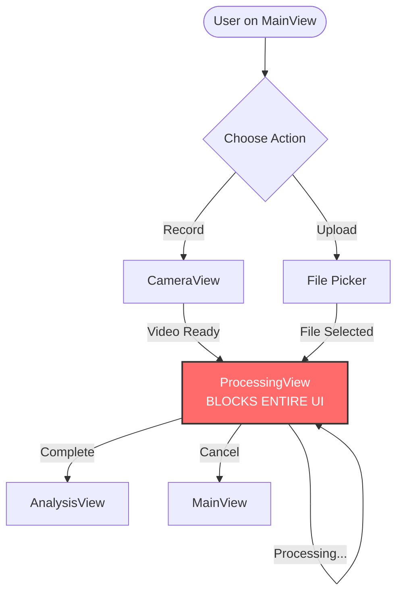
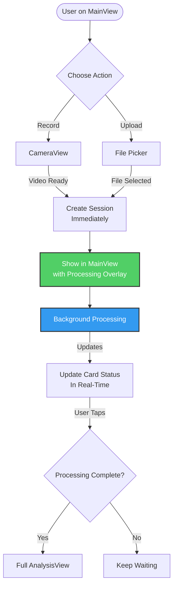
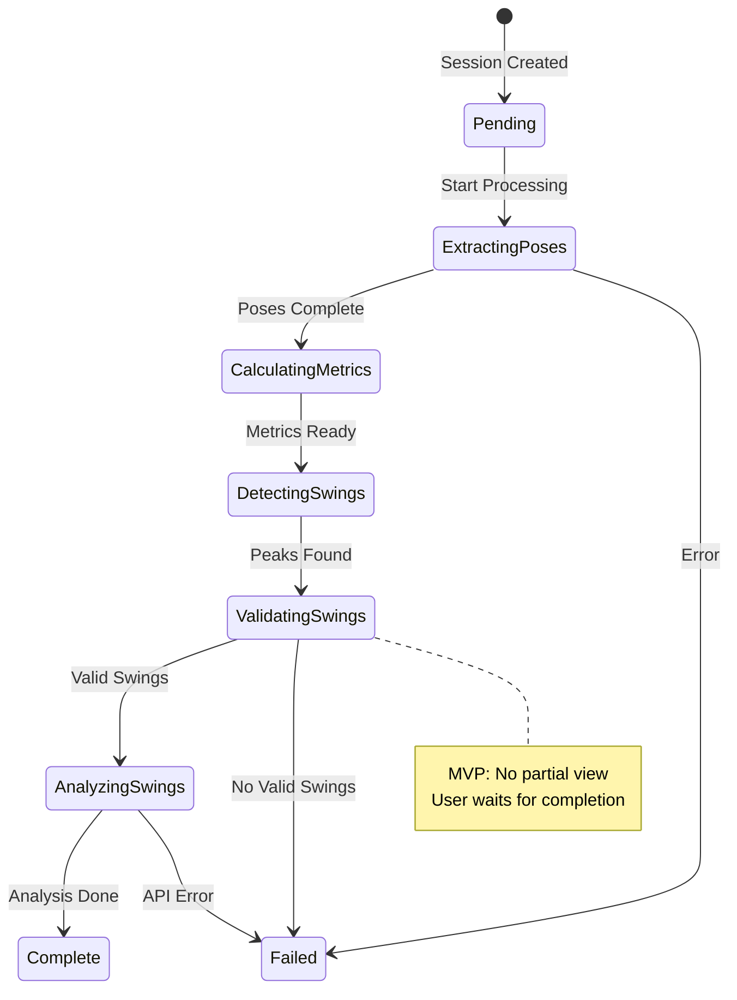

# Inline Video Processing Implementation Plan (MVP)

## Executive Summary
Transform the current blocking ProcessingView into a minimal, non-blocking inline processing experience that shows simple status updates directly on video cards in MainView. Users see their session immediately with clean, text-based progress updates. **MVP Note:** Partial view functionality has been removed for simplicity - users wait for complete processing before viewing analysis.

---

## System Flow Diagrams

### Current Flow (Blocking)


### New Flow (Non-Blocking) - MVP


### Processing Pipeline States


---

## Implementation Steps

**Note:** This implementation focuses on minimal, clean UI with text-based status updates rather than complex animations. The goal is clarity and professional simplicity.

### Phase 1: Data Model Enhancement (2-3 hours)
**Goal:** Add processing state tracking to Session model

#### Step 1.1: Create ProcessingStatus Enum
**File:** `Models/Session.swift`

```swift
// Add to Session.swift
extension Session {
    enum ProcessingStatus: Codable {
        case pending
        case extractingPoses(progress: Float)
        case calculatingMetrics
        case detectingSwings  
        case validatingSwings(current: Int, total: Int)
        case analyzingSwings(current: Int, total: Int)
        case complete
        case failed(error: String)
        
        // Helper computed properties
        var isProcessing: Bool {
            switch self {
            case .complete, .failed:
                return false
            default:
                return true
            }
        }
        
        // MVP: Removed canShowPartialResults - users wait for completion
        
        var statusText: String {
            switch self {
            case .pending: return "Preparing..."
            case .extractingPoses: return "Detecting motion"
            case .calculatingMetrics: return "Calculating metrics"
            case .detectingSwings: return "Finding swings"
            case .validatingSwings(let c, let t): return "Validating \(c)/\(t)"
            case .analyzingSwings(let c, let t): return "AI Analysis \(c)/\(t)"
            case .complete: return "Ready"
            case .failed(let error): return "Failed: \(error)"
            }
        }
    }
}
```

**Rationale:** 
- Enum provides type-safe state tracking
- Computed properties simplify UI logic
- Codable allows persistence across app launches

#### Step 1.2: Update Session Model
**File:** `Models/Session.swift`

```swift
struct Session: Identifiable, Codable {
    let id = UUID()
    let videoURL: URL
    let date: Date
    var thumbnailPath: String?
    
    // NEW: Processing state
    var processingStatus: ProcessingStatus = .pending
    var partialPoseFrames: [PoseFrame]?  // Available after pose extraction
    var analysisResults: [AnalysisResult]?  // Available after completion
    var processorID: UUID?  // Links to active processor
    
    // NEW: Error recovery
    var lastError: String?
    var retryCount: Int = 0
    var maxRetries: Int = 3
}
```

**Rationale:**
- Partial data allows progressive UI updates
- processorID links to background task for cancellation
- Retry mechanism handles transient failures

---

### Phase 2: Background Processing Infrastructure (3 hours)
**Goal:** Create a manager that handles multiple concurrent video processing tasks

#### Step 2.1: Create ProcessingManager Singleton
**File:** `Managers/ProcessingManager.swift`

```swift
import Foundation
import Combine

@MainActor
final class ProcessingManager: ObservableObject {
    static let shared = ProcessingManager()
    
    // Active processors keyed by session ID
    @Published private(set) var activeProcessors: [UUID: VideoProcessor] = [:]
    
    // Processing queue to limit concurrent operations
    private let processingQueue = DispatchQueue(
        label: "com.swingmaster.processing",
        qos: .userInitiated,
        attributes: .concurrent
    )
    private let maxConcurrentProcessing = 2
    private var currentProcessingCount = 0
    private var pendingQueue: [(Session, URL)] = []
    
    private var cancellables = Set<AnyCancellable>()
    
    private init() {}
    
    // MARK: - Public API
    
    func startProcessing(for session: Session, videoURL: URL, sessionStore: SessionStore) {
        if currentProcessingCount >= maxConcurrentProcessing {
            // Queue for later
            pendingQueue.append((session, videoURL))
            sessionStore.updateSession(session.id) { 
                $0.processingStatus = .pending 
            }
            return
        }
        
        // Start immediately
        Task {
            await processVideo(session: session, videoURL: videoURL, sessionStore: sessionStore)
        }
    }
    
    func cancelProcessing(for sessionID: UUID) {
        activeProcessors[sessionID] = nil
        // TODO: Add actual cancellation logic to VideoProcessor
    }
    
    func retryProcessing(for session: Session, sessionStore: SessionStore) {
        guard let videoURL = session.videoURL,
              session.retryCount < session.maxRetries else { return }
        
        sessionStore.updateSession(session.id) { 
            $0.retryCount += 1
            $0.processingStatus = .pending
        }
        
        startProcessing(for: session, videoURL: videoURL, sessionStore: sessionStore)
    }
    
    // MARK: - Private Processing
    
    private func processVideo(session: Session, videoURL: URL, sessionStore: SessionStore) async {
        currentProcessingCount += 1
        defer { 
            currentProcessingCount -= 1
            processNextInQueue(sessionStore: sessionStore)
        }
        
        // Create processor
        let processor = VideoProcessor(geminiAPIKey: Config.geminiAPIKey)
        activeProcessors[session.id] = processor
        
        // Link processor state to session status
        processor.$state
            .receive(on: DispatchQueue.main)
            .sink { [weak sessionStore] state in
                sessionStore?.updateSession(session.id) { session in
                    session.processingStatus = self.mapProcessorState(state)
                }
            }
            .store(in: &cancellables)
        
        // Start processing
        do {
            let results = await processor.processVideo(videoURL)
            
            // Success - update session
            await MainActor.run {
                sessionStore.updateSession(session.id) { session in
                    session.processingStatus = .complete
                    session.analysisResults = results
                    session.lastError = nil
                }
                activeProcessors[session.id] = nil
            }
        } catch {
            // Failure - update session with error
            await MainActor.run {
                sessionStore.updateSession(session.id) { session in
                    session.processingStatus = .failed(error: error.localizedDescription)
                    session.lastError = error.localizedDescription
                }
                activeProcessors[session.id] = nil
            }
        }
    }
    
    private func processNextInQueue(sessionStore: SessionStore) {
        guard !pendingQueue.isEmpty,
              currentProcessingCount < maxConcurrentProcessing else { return }
        
        let (session, url) = pendingQueue.removeFirst()
        Task {
            await processVideo(session: session, videoURL: url, sessionStore: sessionStore)
        }
    }
    
    private func mapProcessorState(_ state: VideoProcessor.ProcessingState) -> Session.ProcessingStatus {
        switch state {
        case .extractingPoses(let progress):
            return .extractingPoses(progress: progress)
        case .calculatingMetrics:
            return .calculatingMetrics
        case .detectingSwings:
            return .detectingSwings
        case .validatingSwings(let current, let total):
            return .validatingSwings(current: current, total: total)
        case .analyzingSwings(let current, let total):
            return .analyzingSwings(current: current, total: total)
        case .complete:
            return .complete
        }
    }
}
```

**Rationale:**
- Singleton ensures single source of truth for processing
- Queue management prevents resource exhaustion
- Combine publishers enable reactive UI updates
- Error handling allows retry logic

---

### Phase 3: Enhanced Video Session Card (2 hours)
**Goal:** Update VideoSessionCard to show inline processing status

#### Step 3.1: Create Video Processing Overlay Component
**File:** `Components/VideoProcessingOverlay.swift`

```swift
import SwiftUI

struct VideoProcessingOverlay: View {
    let status: Session.ProcessingStatus
    let onTap: (() -> Void)?
    
    var body: some View {
        ZStack {
            // Dark overlay with blur
            Rectangle()
                .fill(.ultraThinMaterial)
                .overlay(Color.black.opacity(0.3))
            
            VStack(spacing: 12) {
                // Simple progress indicator
                ProgressView()
                    .progressViewStyle(CircularProgressViewStyle(tint: .white))
                    .scaleEffect(0.8)
                
                // Status text
                Text(status.statusText)
                    .font(.system(size: 13, weight: .medium))
                    .foregroundColor(.white)
                
                // Progress bar if applicable
                if let progress = extractProgress() {
                    ProgressView(value: progress)
                        .progressViewStyle(LinearProgressViewStyle())
                        .tint(.white)
                        .frame(width: 100)
                        .scaleEffect(x: 1, y: 0.5)
                }
                
                // MVP: No partial view button - users wait for completion
            }
            .padding(16)
        }
        .cornerRadius(16)
    }
    
    private func extractProgress() -> Double? {
        switch status {
        case .extractingPoses(let progress):
            return Double(progress)
        case .validatingSwings(let current, let total):
            return Double(current) / Double(max(1, total))
        case .analyzingSwings(let current, let total):
            return Double(current) / Double(max(1, total))
        default:
            return nil
        }
    }
}
```

#### Step 3.2: Update VideoSessionCard
**File:** `Components/VideoSessionCard.swift`

```swift
struct VideoSessionCard: View {
    let session: Session
    @EnvironmentObject var processingManager: ProcessingManager
    @State private var showingDetails = false
    
    var body: some View {
        ZStack {
            // Base card with thumbnail
            cardContent
            
            // Processing overlay when active
            if session.processingStatus.isProcessing {
                VideoProcessingOverlay(status: session.processingStatus)
            }
            
            // Error state with retry
            if case .failed(let error) = session.processingStatus {
                ProcessingErrorOverlay(
                    error: error,
                    onRetry: { 
                        processingManager.retryProcessing(
                            for: session, 
                            sessionStore: sessionStore
                        )
                    }
                )
            }
        }
        .sheet(isPresented: $showingDetails) {
            PartialAnalysisView(session: session)
        }
    }
}
```

**Rationale:**
- Simple overlay shows processing status without distraction
- Minimal UI keeps focus on the video content
- Error state enables quick recovery
- No complex animations to reduce cognitive load

---

### Phase 4: Update Navigation Flow (2 hours)
**Goal:** Integrate new processing flow into app navigation

#### Step 4.1: Update ContentView Flow
**File:** `ContentView.swift`

```swift
struct ContentView: View {
    @StateObject private var sessionStore = SessionStore()
    @StateObject private var processingManager = ProcessingManager.shared
    @StateObject private var navigationState = NavigationState()
    
    var body: some View {
        NavigationStack(path: $navigationState.path) {
            MainView()
                .navigationDestination(for: NavigationDestination.self) { destination in
                    switch destination {
                    case .camera:
                        CameraView { videoURL in
                            handleNewVideo(videoURL, source: .camera)
                        }
                    case .analysis(let session):
                        // MVP: Only show analysis when complete
                        if session.processingStatus == .complete {
                            AnalysisView(session: session)
                        }
                    case .picker:
                        // Inline picker presentation
                        EmptyView()
                    }
                }
                .environmentObject(sessionStore)
                .environmentObject(processingManager)
        }
        .sheet(item: $navigationState.activeSheet) { sheet in
            switch sheet {
            case .recordOptions:
                RecordOptionsModal(
                    onRecord: {
                        navigationState.push(.camera)
                    },
                    onUpload: {
                        navigationState.showPicker()
                    }
                )
            case .picker:
                VideoPicker { url in
                    handleNewVideo(url, source: .upload)
                }
            }
        }
    }
    
    private func handleNewVideo(_ url: URL, source: VideoSource) {
        // Step 1: Create session immediately
        let session = Session(
            videoURL: url,
            date: Date(),
            processingStatus: .pending,
            source: source
        )
        
        // Step 2: Generate thumbnail asynchronously
        Task {
            if let thumbnail = await VideoStorage.generateThumbnail(for: url, at: 1.0) {
                sessionStore.updateSession(session.id) { 
                    $0.thumbnailPath = thumbnail 
                }
            }
        }
        
        // Step 3: Add to store (appears in UI immediately)
        sessionStore.add(session)
        
        // Step 4: Start background processing
        processingManager.startProcessing(
            for: session, 
            videoURL: url, 
            sessionStore: sessionStore
        )
        
        // Step 5: Return to main view
        navigationState.popToRoot()
        
        // Step 6: Scroll to new session (visual feedback)
        withAnimation(.spring()) {
            sessionStore.scrollToSession = session.id
        }
    }
}
```

**Rationale:**
- Immediate session creation provides instant feedback
- Async thumbnail generation doesn't block UI
- Navigation state management keeps flow clean
- Auto-scroll draws attention to new content

#### Step 4.2: Create Navigation State Manager
**File:** `Navigation/NavigationState.swift`

```swift
enum NavigationDestination: Hashable {
    case camera
    case analysis(Session)
    case picker
}

enum SheetDestination: Identifiable {
    case recordOptions
    case picker
    
    var id: String {
        switch self {
        case .recordOptions: return "recordOptions"
        case .picker: return "picker"
        }
    }
}

@MainActor
class NavigationState: ObservableObject {
    @Published var path = NavigationPath()
    @Published var activeSheet: SheetDestination?
    
    func push(_ destination: NavigationDestination) {
        path.append(destination)
    }
    
    func popToRoot() {
        path.removeLast(path.count)
    }
    
    func showRecordOptions() {
        activeSheet = .recordOptions
    }
    
    func showPicker() {
        activeSheet = .picker
    }
}
```

---

### Phase 5: Error Handling & Retry Logic (1 hour)
**Goal:** Add minimal error states and retry functionality

#### Step 5.1: Create Processing Error Overlay Component
**File:** `Views/ProcessingView.swift` (merged into existing file)

```swift
import SwiftUI

struct ProcessingErrorOverlay: View {
    let error: String
    let onRetry: () -> Void
    
    var body: some View {
        ZStack {
            // Semi-transparent red overlay
            Rectangle()
                .fill(Color.red.opacity(0.1))
                .overlay(Color.black.opacity(0.4))
            
            VStack(spacing: 10) {
                Image(systemName: "exclamationmark.triangle.fill")
                    .font(.system(size: 24))
                    .foregroundColor(.red)
                
                Text("Processing Failed")
                    .font(.system(size: 12, weight: .semibold))
                    .foregroundColor(.white)
                
                Button(action: onRetry) {
                    Text("Retry")
                        .font(.system(size: 11, weight: .medium))
                        .foregroundColor(.black)
                        .padding(.horizontal, 16)
                        .padding(.vertical, 5)
                        .background(Color.white)
                        .cornerRadius(10)
                }
            }
        }
        .cornerRadius(16)
    }
}
```

---

## Testing Strategy

### Unit Tests
```swift
// ProcessingManagerTests.swift
func testSessionCreationImmediate() {
    let manager = ProcessingManager.shared
    let store = SessionStore()
    
    let videoURL = URL(fileURLWithPath: "test.mp4")
    manager.startProcessing(for: session, videoURL: videoURL, sessionStore: store)
    
    XCTAssertNotNil(store.sessions.first)
    XCTAssertEqual(store.sessions.first?.processingStatus, .pending)
}

func testProcessingStateTransitions() {
    // Test that states transition correctly
}

func testErrorRecovery() {
    // Test retry mechanism
}
```

### UI Tests
```swift
// ProcessingFlowUITests.swift
func testVideoAppearsImmediately() {
    app.buttons["Record"].tap()
    // Record video
    app.buttons["END"].tap()
    
    // Should return to MainView with new session visible
    XCTAssert(app.cells["session-0"].exists)
    XCTAssert(app.staticTexts["Processing..."].exists)
}
```

---

## MVP Simplifications

For the MVP release, the following simplifications have been made:
1. **No Partial View**: Users cannot view partial results during processing
2. **Wait for Completion**: Analysis view only accessible after full processing completes
3. **Simplified UI**: Processing overlay shows status only, no interaction buttons
4. **Cleaner Flow**: Reduced complexity in navigation logic

These features can be re-added in future iterations based on user feedback.

---

## Migration Checklist

- [x] **Day 1**: Implement Session.ProcessingStatus and ProcessingManager
- [x] **Day 2**: Create minimal VideoProcessingOverlay and update VideoSessionCard
- [x] **Day 3**: Wire navigation flow and background processing
- [x] **Day 4**: Add error handling and retry logic
- [x] **Day 5**: Testing and bug fixes
- [x] **MVP Adjustment**: Remove partial view functionality for simplicity

---

## Performance Considerations

1. **Thumbnail Generation**: Async, doesn't block session creation
2. **Processing Queue**: Limit 2 concurrent to prevent memory issues
3. **Partial Results**: Allow navigation before full completion
4. **State Updates**: Throttled to prevent excessive rerenders
5. **Minimal UI**: Simple status text reduces rendering overhead

---

## Error Recovery Strategies

| Error Type | Recovery Strategy | User Feedback |
|------------|------------------|---------------|
| Network timeout | Exponential backoff retry | "Connection issue, retrying..." |
| Gemini API error | Fallback to local analysis | "Using basic analysis" |
| Pose detection fail | Show video only | "Motion detection unavailable" |
| Out of memory | Queue for later | "Will process when ready" |

---

## Success Metrics

- **Time to First Pixel**: < 100ms after recording/upload
- **Perceived Performance**: User sees progress immediately
- **Completion Rate**: 95%+ successful processing
- **Retry Success**: 80%+ recover on first retry
- **User Satisfaction**: Reduced complaints about "stuck" processing