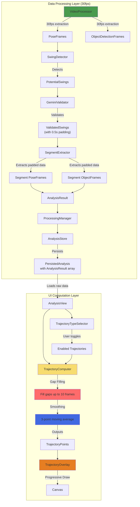

# Tennis Swing Trajectory Visualization - Complete Implementation Plan

## Current Issues Found in Codebase

1. **MockShot is still everywhere**: `TimelineStripEnhanced`, `AnalysisView`, `AnalysisStore` all use MockShot
2. **Object detection not implemented**: `processVideoWithObjects` returns empty object frames
3. **Wrong frame rate**: Using 10fps instead of 30fps
4. **No swing padding**: Swings may be cut off at boundaries
5. **No trajectory computation**: Missing entirely from the codebase

## Architecture Overview



## 1. Data Models - Store Raw Data Only

### Update Core Models

```swift
// Models/AnalysisResult.swift - COMPLETE REWRITE
import Foundation
import CoreGraphics

public struct AnalysisResult: Identifiable, Codable, Sendable {
    public let id: UUID
    public let segment: SwingSegment  // Already has startTime, endTime, frames
    public let swingType: ShotType
    public let score: Float
    public let strengths: [String]
    public let improvements: [String]
    public let keyFrames: [KeyFrame]
    
    // NEW: Store raw frame data for this segment (with padding)
    public let poseFrames: [PoseFrame]        // ~90 frames @ 30fps for 3s segment
    public let objectFrames: [ObjectDetectionFrame]  // Same timespan
    
    public init(
        segment: SwingSegment,
        swingType: ShotType,
        score: Float,
        strengths: [String],
        improvements: [String],
        keyFrames: [KeyFrame] = [],
        poseFrames: [PoseFrame] = [],
        objectFrames: [ObjectDetectionFrame] = []
    ) {
        self.id = UUID()
        self.segment = segment
        self.swingType = swingType
        self.score = score
        self.strengths = strengths
        self.improvements = improvements
        self.keyFrames = keyFrames
        self.poseFrames = poseFrames
        self.objectFrames = objectFrames
    }
}

// Models/ObjectDetectionFrame.swift - NEW FILE
import CoreGraphics

public struct ObjectDetectionFrame: Codable, Sendable {
    public let timestamp: TimeInterval
    public let racket: RacketDetection?
    public let ball: BallDetection?
    
    public init(timestamp: TimeInterval, racket: RacketDetection? = nil, ball: BallDetection? = nil) {
        self.timestamp = timestamp
        self.racket = racket
        self.ball = ball
    }
}

public struct RacketDetection: Codable, Sendable {
    public let boundingBox: CGRect  // Normalized 0-1
    public let confidence: Float
    
    public init(boundingBox: CGRect, confidence: Float) {
        self.boundingBox = boundingBox
        self.confidence = confidence
    }
}

public struct BallDetection: Codable, Sendable {
    public let boundingBox: CGRect  // Normalized 0-1
    public let confidence: Float
    
    public init(boundingBox: CGRect, confidence: Float) {
        self.boundingBox = boundingBox
        self.confidence = confidence
    }
}

// Models/PoseFrame.swift - UPDATE to be Codable
public struct PoseFrame: Sendable, Codable {
    // ... existing properties ...
    // Make sure this is Codable for persistence
}
```

## 2. Fix Video Processing Pipeline (30fps + Object Detection)

```swift
// Core/VideoProcessor.swift - CRITICAL FIXES

private func processVideoWithObjects(_ url: URL) async -> ([PoseFrame], [ObjectDetectionFrame]) {
    let asset = AVAsset(url: url)
    guard let track = asset.tracks(withMediaType: .video).first else { 
        return ([], []) 
    }
    
    var poseFrames: [PoseFrame] = []
    var objectFrames: [ObjectDetectionFrame] = []
    
    do {
        let reader = try AVAssetReader(asset: asset)
        let readerSettings: [String: Any] = [
            kCVPixelBufferPixelFormatTypeKey as String: kCVPixelFormatType_32BGRA
        ]
        let output = AVAssetReaderTrackOutput(track: track, outputSettings: readerSettings)
        output.alwaysCopiesSampleData = false
        
        if reader.canAdd(output) { 
            reader.add(output) 
        }
        
        reader.startReading()
        
        // CHANGE: Use 30fps (no sampling - process every frame)
        // Assuming source is 30fps, process all frames
        var frameIndex = 0
        let totalDuration = CMTimeGetSeconds(asset.duration)
        
        while reader.status == .reading {
            guard let sample = output.copyNextSampleBuffer() else { continue }
            defer { CMSampleBufferInvalidate(sample) }
            
            guard let pixelBuffer = CMSampleBufferGetImageBuffer(sample) else { continue }
            let pts = CMSampleBufferGetPresentationTimeStamp(sample)
            let timestamp = CMTimeGetSeconds(pts)
            
            // Progress update
            frameIndex += 1
            if frameIndex % 30 == 0 { // Update progress every second
                let progress = Float(timestamp / totalDuration)
                Task { @MainActor in 
                    self.state = .extractingPoses(progress: progress) 
                }
            }
            
            // Get device orientation for Vision/YOLO
            let orientation = visionOrientation(from: .portrait, isFront: false)
            
            // Run both detections concurrently
            async let poseTask = poseProcessor.processFrame(pixelBuffer, timestamp: timestamp)
            async let objectTask = objectDetector.detectObjects(
                pixelBuffer, 
                timestamp: timestamp,
                orientation: orientation
            )
            
            let (poseFrame, detection) = await (poseTask, objectTask)
            
            // Store pose frame if detected
            if let pf = poseFrame {
                poseFrames.append(pf)
            }
            
            // Store object detection (even if nil)
            let racket = detection?.racketBox != nil && detection!.racketConfidence > 0.3 
                ? RacketDetection(
                    boundingBox: detection!.racketBox!,
                    confidence: detection!.racketConfidence
                ) : nil
                
            let ball = detection?.ballBox != nil && detection!.ballConfidence > 0.3
                ? BallDetection(
                    boundingBox: detection!.ballBox!,
                    confidence: detection!.ballConfidence
                ) : nil
            
            objectFrames.append(ObjectDetectionFrame(
                timestamp: timestamp,
                racket: racket,
                ball: ball
            ))
        }
        
        logger.log("[VideoProcessor] Extracted \(poseFrames.count) poses, \(objectFrames.count) object frames @ 30fps")
    } catch {
        logger.error("[VideoProcessor] Failed to process video: \(error)")
    }
    
    return (poseFrames, objectFrames)
}

// NEW: Extract segment data with padding
private func extractSegmentData(
    swing: ValidatedSwing,
    allPoseFrames: [PoseFrame],
    allObjectFrames: [ObjectDetectionFrame]
) -> (poseFrames: [PoseFrame], objectFrames: [ObjectDetectionFrame], paddedSegment: SwingSegment) {
    
    let swingStart = swing.frames.first?.timestamp ?? 0
    let swingEnd = swing.frames.last?.timestamp ?? 0
    
    // Add 0.5 second padding to capture full motion
    let paddingSeconds = 0.5
    let paddedStart = swingStart - paddingSeconds
    let paddedEnd = swingEnd + paddingSeconds
    
    // Filter frames within padded window
    let relevantPoses = allPoseFrames.filter { 
        $0.timestamp >= paddedStart && $0.timestamp <= paddedEnd 
    }
    
    let relevantObjects = allObjectFrames.filter { 
        $0.timestamp >= paddedStart && $0.timestamp <= paddedEnd 
    }
    
    // Create padded segment
    let paddedSegment = SwingSegment(
        startTime: paddedStart,
        endTime: paddedEnd,
        frames: swing.frames  // Keep original validated frames
    )
    
    return (relevantPoses, relevantObjects, paddedSegment)
}

// Update processVideo to use 30fps and store raw data
public func processVideo(_ url: URL) async -> [AnalysisResult] {
    // ... existing swing detection ...
    
    // Analyze validated swings WITH raw segment data
    var results: [AnalysisResult] = []
    for (idx, swing) in validated.enumerated() {
        self.state = .analyzingSwings(current: idx + 1, total: validated.count)
        
        // Extract segment data with padding
        let (segmentPoses, segmentObjects, paddedSegment) = extractSegmentData(
            swing: swing,
            allPoseFrames: poseFrames,
            allObjectFrames: objectFrames
        )
        
        let segmentMetrics = metricsCalculator.calculateSegmentMetrics(for: swing.frames)
        
        if let analysis = try? await geminiValidator.analyzeSwing(swing, metrics: segmentMetrics) {
            // Create result with raw data
            let result = AnalysisResult(
                segment: paddedSegment,  // Use padded segment
                swingType: analysis.swingType,
                score: analysis.score,
                strengths: analysis.strengths,
                improvements: analysis.improvements,
                keyFrames: analysis.keyFrames,
                poseFrames: segmentPoses,      // Store segment poses
                objectFrames: segmentObjects    // Store segment objects
            )
            results.append(result)
        }
    }
    
    return results
}
```

## 3. On-Demand Trajectory Computer with Gap Filling & Smoothing

```swift
// Utils/TrajectoryComputer.swift - NEW FILE
import SwiftUI
import Vision

public struct TrajectoryPoint: Equatable {
    let x: Float        // Normalized 0-1
    let y: Float        // Normalized 0-1
    let timestamp: Double // Relative to shot start
    let confidence: Float
    let isInterpolated: Bool  // Track if this point was gap-filled
    
    init(x: Float, y: Float, timestamp: Double, confidence: Float, isInterpolated: Bool = false) {
        self.x = x
        self.y = y
        self.timestamp = timestamp
        self.confidence = confidence
        self.isInterpolated = isInterpolated
    }
}

public enum TrajectoryType: String, CaseIterable, Identifiable {
    case rightWrist = "Right Wrist"
    case leftWrist = "Left Wrist"
    case rightElbow = "Right Elbow"
    case leftElbow = "Left Elbow"
    case rightShoulder = "Right Shoulder"
    case leftShoulder = "Left Shoulder"
    case racketCenter = "Racket"
    case ballCenter = "Ball"
    
    public var id: String { rawValue }
    
    var color: Color {
        switch self {
        case .rightWrist, .leftWrist:
            return Color(hex: "#5CB85C") // Tennis green
        case .rightElbow, .leftElbow:
            return Color(hex: "#4169E1") // Royal blue
        case .rightShoulder, .leftShoulder:
            return Color(hex: "#FF6B6B") // Coral
        case .racketCenter:
            return Color(hex: "#F7DC6F") // Tennis yellow
        case .ballCenter:
            return Color(hex: "#FFD700") // Gold
        }
    }
    
    var icon: String {
        switch self {
        case .rightWrist, .leftWrist: return "hand.raised"
        case .rightElbow, .leftElbow: return "figure.arms.open"
        case .rightShoulder, .leftShoulder: return "person"
        case .racketCenter: return "tennisball"
        case .ballCenter: return "circle.fill"
        }
    }
}

public struct TrajectoryOptions {
    let fillGaps: Bool
    let maxGapFrames: Int  // Maximum gap to fill (in frames)
    let smooth: Bool
    let smoothingWindow: Int
    
    static let `default` = TrajectoryOptions(
        fillGaps: true,
        maxGapFrames: 10,  // At 30fps, 10 frames = 0.33 seconds
        smooth: true,
        smoothingWindow: 3
    )
}

public struct TrajectoryComputer {
    
    public static func computeTrajectory(
        type: TrajectoryType,
        poseFrames: [PoseFrame],
        objectFrames: [ObjectDetectionFrame],
        startTime: Double,
        options: TrajectoryOptions = .default
    ) -> [TrajectoryPoint] {
        
        // Extract raw points based on type
        var points: [TrajectoryPoint]
        
        switch type {
        case .rightWrist:
            points = extractJointTrajectory(.rightWrist, from: poseFrames, startTime: startTime)
        case .leftWrist:
            points = extractJointTrajectory(.leftWrist, from: poseFrames, startTime: startTime)
        case .rightElbow:
            points = extractJointTrajectory(.rightElbow, from: poseFrames, startTime: startTime)
        case .leftElbow:
            points = extractJointTrajectory(.leftElbow, from: poseFrames, startTime: startTime)
        case .rightShoulder:
            points = extractJointTrajectory(.rightShoulder, from: poseFrames, startTime: startTime)
        case .leftShoulder:
            points = extractJointTrajectory(.leftShoulder, from: poseFrames, startTime: startTime)
        case .racketCenter:
            points = extractRacketTrajectory(from: objectFrames, startTime: startTime)
        case .ballCenter:
            points = extractBallTrajectory(from: objectFrames, startTime: startTime)
        }
        
        // Apply gap filling if enabled
        if options.fillGaps && points.count > 1 {
            points = fillGaps(in: points, maxGapFrames: options.maxGapFrames)
        }
        
        // Apply smoothing if enabled
        if options.smooth && points.count > options.smoothingWindow {
            points = smoothTrajectory(points, windowSize: options.smoothingWindow)
        }
        
        return points
    }
    
    // MARK: - Extraction Methods
    
    private static func extractJointTrajectory(
        _ joint: VNHumanBodyPoseObservation.JointName,
        from frames: [PoseFrame],
        startTime: Double
    ) -> [TrajectoryPoint] {
        return frames.compactMap { frame in
            guard let point = frame.joints[joint],
                  let confidence = frame.confidences[joint],
                  confidence > 0.3 else { return nil }
            
            return TrajectoryPoint(
                x: Float(point.x),
                y: Float(point.y),
                timestamp: frame.timestamp - startTime,
                confidence: confidence
            )
        }
    }
    
    private static func extractRacketTrajectory(
        from frames: [ObjectDetectionFrame],
        startTime: Double
    ) -> [TrajectoryPoint] {
        return frames.compactMap { frame in
            guard let racket = frame.racket,
                  racket.confidence > 0.3 else { return nil }
            
            return TrajectoryPoint(
                x: Float(racket.boundingBox.midX),
                y: Float(racket.boundingBox.midY),
                timestamp: frame.timestamp - startTime,
                confidence: racket.confidence
            )
        }
    }
    
    private static func extractBallTrajectory(
        from frames: [ObjectDetectionFrame],
        startTime: Double
    ) -> [TrajectoryPoint] {
        return frames.compactMap { frame in
            guard let ball = frame.ball,
                  ball.confidence > 0.3 else { return nil }
            
            return TrajectoryPoint(
                x: Float(ball.boundingBox.midX),
                y: Float(ball.boundingBox.midY),
                timestamp: frame.timestamp - startTime,
                confidence: ball.confidence
            )
        }
    }
    
    // MARK: - Gap Filling (up to 10 frames at 30fps)
    
    private static func fillGaps(in points: [TrajectoryPoint], maxGapFrames: Int) -> [TrajectoryPoint] {
        guard points.count > 1 else { return points }
        
        var filled: [TrajectoryPoint] = []
        filled.append(points[0])
        
        let frameInterval = 1.0 / 30.0  // 30fps
        
        for i in 1..<points.count {
            let prev = points[i-1]
            let curr = points[i]
            let timeDiff = curr.timestamp - prev.timestamp
            let frameGap = Int((timeDiff / frameInterval).rounded()) - 1
            
            if frameGap > 0 && frameGap <= maxGapFrames {
                // Linear interpolation for gaps up to maxGapFrames
                for j in 1...frameGap {
                    let t = Float(j) / Float(frameGap + 1)
                    let interpolated = TrajectoryPoint(
                        x: prev.x + (curr.x - prev.x) * t,
                        y: prev.y + (curr.y - prev.y) * t,
                        timestamp: prev.timestamp + Double(j) * frameInterval,
                        confidence: min(prev.confidence, curr.confidence) * 0.7,
                        isInterpolated: true  // Mark as interpolated
                    )
                    filled.append(interpolated)
                }
            }
            
            filled.append(curr)
        }
        
        return filled
    }
    
    // MARK: - Smoothing (3-point moving average)
    
    private static func smoothTrajectory(_ points: [TrajectoryPoint], windowSize: Int = 3) -> [TrajectoryPoint] {
        guard points.count > windowSize else { return points }
        
        var smoothed: [TrajectoryPoint] = []
        
        for i in 0..<points.count {
            let startIdx = max(0, i - windowSize/2)
            let endIdx = min(points.count - 1, i + windowSize/2)
            
            var sumX: Float = 0
            var sumY: Float = 0
            var count: Float = 0
            
            for j in startIdx...endIdx {
                sumX += points[j].x
                sumY += points[j].y
                count += 1
            }
            
            smoothed.append(TrajectoryPoint(
                x: sumX / count,
                y: sumY / count,
                timestamp: points[i].timestamp,
                confidence: points[i].confidence,
                isInterpolated: points[i].isInterpolated
            ))
        }
        
        return smoothed
    }
}
```

## 4. Update UI Components to Use AnalysisResult

### Fix AnalysisStore

```swift
// Managers/AnalysisStore.swift - UPDATE
struct PersistedAnalysis: Codable, Equatable {
    let videoFileName: String
    let duration: Double
    let results: [AnalysisResult]  // Changed from shots: [MockShot]
}

enum AnalysisStore {
    static func save(videoURL: URL, duration: Double, results: [AnalysisResult]) {
        let fileName = videoURL.lastPathComponent
        var all = cache
        all[fileName] = PersistedAnalysis(
            videoFileName: fileName, 
            duration: duration, 
            results: results
        )
        persist(all)
        cache = all
    }
    
    // Load returns AnalysisResult array
    static func load(videoURL: URL) -> PersistedAnalysis? {
        let fileName = videoURL.lastPathComponent
        return cache[fileName]
    }
}
```

### Fix TimelineStripEnhanced

```swift
// Components/TimelineStripEnhanced.swift - UPDATE
struct TimelineStripEnhanced: View {
    let duration: Double
    let shots: [AnalysisResult]  // CHANGED from [MockShot]
    @Binding var selectedShotID: AnalysisResult.ID?
    @Binding var currentTime: Double
    @Binding var isPlaying: Bool
    
    var onPlaySegment: ((AnalysisResult) -> Void)?
    var onPrev: (() -> Void)? = nil
    var onNext: (() -> Void)? = nil
    
    // Update all references:
    // shot.type → shot.swingType
    // shot.startTime → shot.segment.startTime
    // shot.endTime → shot.segment.endTime
    // shot.time → (shot.segment.startTime + shot.segment.endTime) / 2
}
```

### Fix AnalysisView

```swift
// Views/AnalysisView.swift - UPDATE
struct AnalysisView: View {
    let videoURL: URL?
    let duration: Double
    let shots: [AnalysisResult]  // CHANGED from [MockShot]
    
    @State private var selectedShotID: AnalysisResult.ID?
    @State private var currentTime: Double = 0
    @State private var isPlaying: Bool = false
    @State private var playingSegment: AnalysisResult? = nil
    
    // NEW: Trajectory controls
    @State private var showTrajectoryMenu = false
    @State private var enabledTrajectories: Set<TrajectoryType> = [.rightWrist, .racketCenter]
    @State private var trajectoryOptions = TrajectoryOptions.default
    @State private var videoAspectRatio: CGFloat = 16.0/9.0
    
    // ... rest of implementation
}
```

## 5. Trajectory Overlay with Progressive Animation

```swift
// Components/TrajectoryOverlay.swift - NEW FILE
import SwiftUI
import AVFoundation

struct TrajectoryOverlay: View {
    let shot: AnalysisResult
    let currentTime: Double        // Relative to shot start
    let shotDuration: Double
    let videoAspectRatio: CGFloat
    let isPlaying: Bool
    let enabledTrajectories: Set<TrajectoryType>
    let options: TrajectoryOptions
    
    @State private var showFullPath = false
    @State private var trajectoryCache: [TrajectoryType: [TrajectoryPoint]] = [:]
    
    var body: some View {
        GeometryReader { geometry in
            Canvas { context, size in
                let videoRect = calculateVideoRect(viewSize: size, videoAspectRatio: videoAspectRatio)
                let progress = min(1.0, max(0, currentTime / shotDuration))
                let hasStarted = currentTime > 0.01
                let hasCompleted = progress >= 0.95 || showFullPath
                
                // Draw each enabled trajectory
                for type in enabledTrajectories {
                    let points = getOrComputeTrajectory(for: type)
                    
                    if !points.isEmpty {
                        drawTrajectory(
                            context: context,
                            points: points,
                            color: type.color,
                            videoRect: videoRect,
                            progress: progress,
                            showDotOnly: !hasStarted,
                            showFullPath: hasCompleted
                        )
                    }
                }
            }
        }
        .onAppear { precomputeTrajectories() }
        .onChange(of: enabledTrajectories) { _, _ in precomputeTrajectories() }
        .onChange(of: currentTime) { _, newTime in
            if newTime / shotDuration >= 0.95 {
                withAnimation(.easeInOut(duration: 0.3)) {
                    showFullPath = true
                }
            } else if newTime < 0.1 {
                showFullPath = false
            }
        }
    }
    
    private func calculateVideoRect(viewSize: CGSize, videoAspectRatio: CGFloat) -> CGRect {
        let viewAspectRatio = viewSize.width / viewSize.height
        
        var videoWidth: CGFloat
        var videoHeight: CGFloat
        
        if videoAspectRatio > viewAspectRatio {
            // Letterbox
            videoWidth = viewSize.width
            videoHeight = viewSize.width / videoAspectRatio
        } else {
            // Pillarbox
            videoHeight = viewSize.height
            videoWidth = viewSize.height * videoAspectRatio
        }
        
        let x = (viewSize.width - videoWidth) / 2
        let y = (viewSize.height - videoHeight) / 2
        
        return CGRect(x: x, y: y, width: videoWidth, height: videoHeight)
    }
    
    private func getOrComputeTrajectory(for type: TrajectoryType) -> [TrajectoryPoint] {
        if let cached = trajectoryCache[type] {
            return cached
        }
        
        let computed = TrajectoryComputer.computeTrajectory(
            type: type,
            poseFrames: shot.poseFrames,
            objectFrames: shot.objectFrames,
            startTime: shot.segment.startTime,
            options: options
        )
        
        trajectoryCache[type] = computed
        return computed
    }
    
    private func precomputeTrajectories() {
        trajectoryCache.removeAll()
        for type in enabledTrajectories {
            _ = getOrComputeTrajectory(for: type)
        }
    }
    
    private func drawTrajectory(
        context: GraphicsContext,
        points: [TrajectoryPoint],
        color: Color,
        videoRect: CGRect,
        progress: Double,
        showDotOnly: Bool,
        showFullPath: Bool
    ) {
        // Map normalized points to video rect coordinates
        let screenPoints = points.map { point in
            CGPoint(
                x: videoRect.minX + CGFloat(point.x) * videoRect.width,
                y: videoRect.minY + CGFloat(1.0 - point.y) * videoRect.height
            )
        }
        
        if showDotOnly {
            // Show starting position only
            if let start = screenPoints.first {
                drawStartDot(context: context, at: start, color: color)
            }
        } else if showFullPath {
            // Show complete path with interpolated segments
            drawCompletePath(context: context, 
                           points: zip(screenPoints, points).map { ($0, $1) }, 
                           color: color)
        } else {
            // Progressive drawing
            let visibleCount = max(1, Int(Double(points.count) * progress))
            let visibleScreenPoints = Array(screenPoints.prefix(visibleCount))
            let visibleDataPoints = Array(points.prefix(visibleCount))
            
            drawGrowingPath(context: context,
                          points: zip(visibleScreenPoints, visibleDataPoints).map { ($0, $1) },
                          color: color)
        }
    }
    
    private func drawStartDot(context: GraphicsContext, at point: CGPoint, color: Color) {
        // Pulsing effect
        context.fill(
            Circle().path(in: CGRect(x: point.x - 12, y: point.y - 12, width: 24, height: 24)),
            with: .color(color.opacity(0.2))
        )
        context.fill(
            Circle().path(in: CGRect(x: point.x - 4, y: point.y - 4, width: 8, height: 8)),
            with: .color(color)
        )
    }
    
    private func drawGrowingPath(
        context: GraphicsContext,
        points: [(CGPoint, TrajectoryPoint)],
        color: Color
    ) {
        guard points.count > 1 else {
            if let first = points.first {
                drawStartDot(context: context, at: first.0, color: color)
            }
            return
        }
        
        // Draw path segments with different styles for interpolated points
        for i in 1..<points.count {
            let prev = points[i-1]
            let curr = points[i]
            
            var path = Path()
            path.move(to: prev.0)
            path.addLine(to: curr.0)
            
            let strokeStyle: StrokeStyle
            if curr.1.isInterpolated {
                // Dashed line for interpolated segments
                strokeStyle = StrokeStyle(lineWidth: 2, dash: [4, 2])
            } else {
                // Solid line for actual detected points
                strokeStyle = StrokeStyle(lineWidth: 3)
            }
            
            context.stroke(
                path,
                with: .color(color.opacity(curr.1.isInterpolated ? 0.5 : 0.8)),
                style: strokeStyle
            )
        }
        
        // Current position dot
        if let current = points.last {
            context.fill(
                Circle().path(in: CGRect(x: current.0.x - 5, y: current.0.y - 5, width: 10, height: 10)),
                with: .color(color)
            )
        }
    }
    
    private func drawCompletePath(
        context: GraphicsContext,
        points: [(CGPoint, TrajectoryPoint)],
        color: Color
    ) {
        guard points.count > 1 else { return }
        
        // Draw complete path with visual distinction for interpolated segments
        for i in 1..<points.count {
            let prev = points[i-1]
            let curr = points[i]
            
            var path = Path()
            path.move(to: prev.0)
            path.addLine(to: curr.0)
            
            if curr.1.isInterpolated {
                // Interpolated segment - dashed and lighter
                context.stroke(
                    path,
                    with: .color(color.opacity(0.4)),
                    style: StrokeStyle(lineWidth: 2, dash: [4, 2])
                )
            } else {
                // Actual detected segment - solid
                context.stroke(
                    path,
                    with: .color(color.opacity(0.8)),
                    style: StrokeStyle(lineWidth: 3, lineCap: .round, lineJoin: .round)
                )
            }
        }
        
        // Start and end markers
        if let start = points.first {
            context.fill(
                Circle().path(in: CGRect(x: start.0.x - 3, y: start.0.y - 3, width: 6, height: 6)),
                with: .color(color.opacity(0.6))
            )
        }
        if let end = points.last {
            context.fill(
                Circle().path(in: CGRect(x: end.0.x - 4, y: end.0.y - 4, width: 8, height: 8)),
                with: .color(color)
            )
        }
    }
}
```

## 6. Trajectory Selection UI Component

```swift
// Components/TrajectorySelector.swift - NEW FILE
import SwiftUI

struct TrajectorySelector: View {
    @Binding var enabledTrajectories: Set<TrajectoryType>
    @Binding var trajectoryOptions: TrajectoryOptions
    @State private var isExpanded = false
    
    var body: some View {
        VStack(alignment: .trailing, spacing: 8) {
            // Main toggle button
            Button(action: { withAnimation { isExpanded.toggle() } }) {
                HStack(spacing: 6) {
                    Image(systemName: "scribble.variable")
                    if !enabledTrajectories.isEmpty {
                        Text("\(enabledTrajectories.count)")
                            .font(.caption)
                            .padding(.horizontal, 6)
                            .padding(.vertical, 2)
                            .background(Capsule().fill(Color.tennisGreen))
                            .foregroundColor(.white)
                    }
                }
                .padding(.horizontal, 12)
                .padding(.vertical, 8)
                .background(.regularMaterial)
                .clipShape(Capsule())
            }
            
            if isExpanded {
                VStack(alignment: .leading, spacing: 2) {
                    // Trajectory type toggles
                    ForEach(TrajectoryType.allCases) { type in
                        Button(action: { toggleTrajectory(type) }) {
                            HStack {
                                Image(systemName: type.icon)
                                    .frame(width: 20)
                                    .foregroundColor(type.color)
                                
                                Text(type.rawValue)
                                    .font(.system(size: 13))
                                
                                Spacer()
                                
                                if enabledTrajectories.contains(type) {
                                    Image(systemName: "checkmark")
                                        .font(.system(size: 11, weight: .bold))
                                        .foregroundColor(type.color)
                                }
                            }
                            .padding(.horizontal, 12)
                            .padding(.vertical, 8)
                            .contentShape(Rectangle())
                        }
                        .buttonStyle(PlainButtonStyle())
                    }
                    
                    Divider()
                        .padding(.vertical, 4)
                    
                    // Options toggles
                    VStack(alignment: .leading, spacing: 8) {
                        Toggle("Fill Gaps", isOn: Binding(
                            get: { trajectoryOptions.fillGaps },
                            set: { newValue in
                                trajectoryOptions = TrajectoryOptions(
                                    fillGaps: newValue,
                                    maxGapFrames: trajectoryOptions.maxGapFrames,
                                    smooth: trajectoryOptions.smooth,
                                    smoothingWindow: trajectoryOptions.smoothingWindow
                                )
                            }
                        ))
                        .font(.system(size: 12))
                        
                        Toggle("Smooth Path", isOn: Binding(
                            get: { trajectoryOptions.smooth },
                            set: { newValue in
                                trajectoryOptions = TrajectoryOptions(
                                    fillGaps: trajectoryOptions.fillGaps,
                                    maxGapFrames: trajectoryOptions.maxGapFrames,
                                    smooth: newValue,
                                    smoothingWindow: trajectoryOptions.smoothingWindow
                                )
                            }
                        ))
                        .font(.system(size: 12))
                    }
                    .padding(.horizontal, 12)
                    .padding(.vertical, 4)
                }
                .padding(.vertical, 8)
                .frame(width: 200)
                .background(.regularMaterial)
                .clipShape(RoundedRectangle(cornerRadius: 12))
            }
        }
    }
    
    private func toggleTrajectory(_ type: TrajectoryType) {
        if enabledTrajectories.contains(type) {
            enabledTrajectories.remove(type)
        } else {
            enabledTrajectories.insert(type)
        }
    }
}
```

## 7. Updated AnalysisView with Trajectories

```swift
// Views/AnalysisView.swift - COMPLETE UPDATE
struct AnalysisView: View {
    let videoURL: URL?
    let duration: Double
    let shots: [AnalysisResult]  // Real data!
    
    @State private var selectedShotID: AnalysisResult.ID?
    @State private var currentTime: Double = 0
    @State private var isPlaying: Bool = false
    @State private var playingSegment: AnalysisResult? = nil
    
    // Trajectory controls
    @State private var enabledTrajectories: Set<TrajectoryType> = [.rightWrist, .racketCenter]
    @State private var trajectoryOptions = TrajectoryOptions.default
    @State private var videoAspectRatio: CGFloat = 16.0/9.0
    
    private var currentShot: AnalysisResult? {
        shots.first(where: { $0.id == selectedShotID })
    }
    
    private var shotRelativeTime: Double {
        guard let shot = currentShot else { return 0 }
        return max(0, currentTime - shot.segment.startTime)
    }
    
    var body: some View {
        ScrollView {
            VStack(spacing: 12) {
                ZStack {
                    if let url = videoURL {
                        VideoPlayerView(
                            url: url,
                            currentTime: $currentTime,
                            isPlaying: $isPlaying,
                            segmentStart: playingSegment?.segment.startTime,
                            segmentEnd: playingSegment?.segment.endTime,
                            onSegmentComplete: { playingSegment = nil }
                        )
                        .onAppear { loadVideoAspectRatio(from: url) }
                        .overlay(
                            // Trajectory visualization
                            Group {
                                if let shot = currentShot,
                                   !shot.poseFrames.isEmpty {
                                    TrajectoryOverlay(
                                        shot: shot,
                                        currentTime: shotRelativeTime,
                                        shotDuration: shot.segment.endTime - shot.segment.startTime,
                                        videoAspectRatio: videoAspectRatio,
                                        isPlaying: isPlaying,
                                        enabledTrajectories: enabledTrajectories,
                                        options: trajectoryOptions
                                    )
                                    .allowsHitTesting(false)
                                }
                            }
                        )
                        .overlay(alignment: .topTrailing) {
                            // Trajectory controls
                            TrajectorySelector(
                                enabledTrajectories: $enabledTrajectories,
                                trajectoryOptions: $trajectoryOptions
                            )
                            .padding(12)
                        }
                    }
                }
                .frame(height: 320)
                // ... rest of video container styling
                
                // Timeline
                TimelineStripEnhanced(
                    duration: duration,
                    shots: shots,
                    selectedShotID: $selectedShotID,
                    currentTime: $currentTime,
                    isPlaying: $isPlaying,
                    onPlaySegment: { shot in playSegment(shot) },
                    onPrev: selectPrev,
                    onNext: selectNext
                )
                .padding(.horizontal, 16)
                
                // Insight card
                enhancedInsightCard
                    .padding(.horizontal, 16)
            }
        }
    }
    
    private func loadVideoAspectRatio(from url: URL) {
        Task {
            let asset = AVAsset(url: url)
            guard let track = try? await asset.loadTracks(withMediaType: .video).first else { return }
            
            let size = try? await track.load(.naturalSize)
            let transform = try? await track.load(.preferredTransform)
            
            guard let size = size else { return }
            
            let transformedSize = size.applying(transform ?? .identity)
            let width = abs(transformedSize.width)
            let height = abs(transformedSize.height)
            
            await MainActor.run {
                self.videoAspectRatio = width / height
            }
        }
    }
    
    private func playSegment(_ shot: AnalysisResult) {
        playingSegment = shot
        currentTime = shot.segment.startTime
        isPlaying = true
    }
    
    // Update navigation to use AnalysisResult
    private func selectPrev() {
        guard let id = selectedShotID, 
              let idx = shots.firstIndex(where: { $0.id == id }) else { return }
        let newIndex = max(idx - 1, 0)
        let shot = shots[newIndex]
        selectedShotID = shot.id
        playSegment(shot)
    }
    
    private func selectNext() {
        guard let id = selectedShotID, 
              let idx = shots.firstIndex(where: { $0.id == id }) else { return }
        let newIndex = min(idx + 1, shots.count - 1)
        let shot = shots[newIndex]
        selectedShotID = shot.id
        playSegment(shot)
    }
}
```

## 8. Update ProcessingManager

```swift
// Managers/ProcessingManager.swift - UPDATE
private func processVideo(session: Session, videoURL: URL, sessionStore: SessionStore) async {
    // ... existing setup ...
    
    let results = await processor.processVideo(videoURL)
    
    await MainActor.run {
        // Save real AnalysisResults with raw frame data
        let duration = VideoStorage.getDurationSeconds(for: session.videoURL)
        
        AnalysisStore.save(
            videoURL: session.videoURL,
            duration: duration,
            results: results  // Real AnalysisResult array with pose/object frames
        )
        
        sessionStore.updateSession(session.id) { session in
            session.shotCount = results.count
            session.processingStatus = .complete
        }
    }
}
```

## Implementation Checklist

- [ ] **Phase 1: Data Models**
  - [ ] Update `AnalysisResult` to include `poseFrames` and `objectFrames`
  - [ ] Create `ObjectDetectionFrame`, `RacketDetection`, `BallDetection`
  - [ ] Make `PoseFrame` Codable
  - [ ] Update `AnalysisStore` to use `AnalysisResult`

- [ ] **Phase 2: Video Processing**
  - [ ] Fix `processVideoWithObjects` to actually detect objects
  - [ ] Change to 30fps processing (remove stride)
  - [ ] Add `extractSegmentData` with 0.5s padding
  - [ ] Store raw frame data with each segment

- [ ] **Phase 3: Trajectory Computation**
  - [ ] Create `TrajectoryComputer` with gap filling
  - [ ] Implement 10-frame gap filling at 30fps
  - [ ] Add 3-point moving average smoothing
  - [ ] Mark interpolated points for visual distinction

- [ ] **Phase 4: UI Updates**
  - [ ] Update `TimelineStripEnhanced` to use `AnalysisResult`
  - [ ] Update `AnalysisView` to use `AnalysisResult`
  - [ ] Create `TrajectoryOverlay` component
  - [ ] Create `TrajectorySelector` UI component
  - [ ] Update `VideoSessionCard` to use real data

- [ ] **Phase 5: Cleanup**
  - [ ] Delete `Models/Shot.swift` (MockShot)
  - [ ] Remove all MockShot references
  - [ ] Update `ProcessingManager`
  - [ ] Test complete flow

## Key Technical Details

### Frame Rate: 30fps
- Process every frame from video (no stride)
- Gap filling works up to 10 frames (0.33 seconds)
- Smooth trajectories at native video rate

### Segment Padding: 0.5 seconds
- Captures approach and follow-through
- Ensures full swing is visible
- ~15 extra frames before/after at 30fps

### Visual Feedback
- Solid lines for detected points
- Dashed lines for interpolated gaps
- Progressive animation during playback
- Color coding for different trajectory types

### Performance
- Cache computed trajectories per shot
- Only compute enabled trajectory types
- ~90 frames per segment at 30fps
- Store raw data for future flexibility

This implementation completely removes MockShot, stores raw data for maximum flexibility, and provides smooth trajectory visualization with gap filling and user controls.